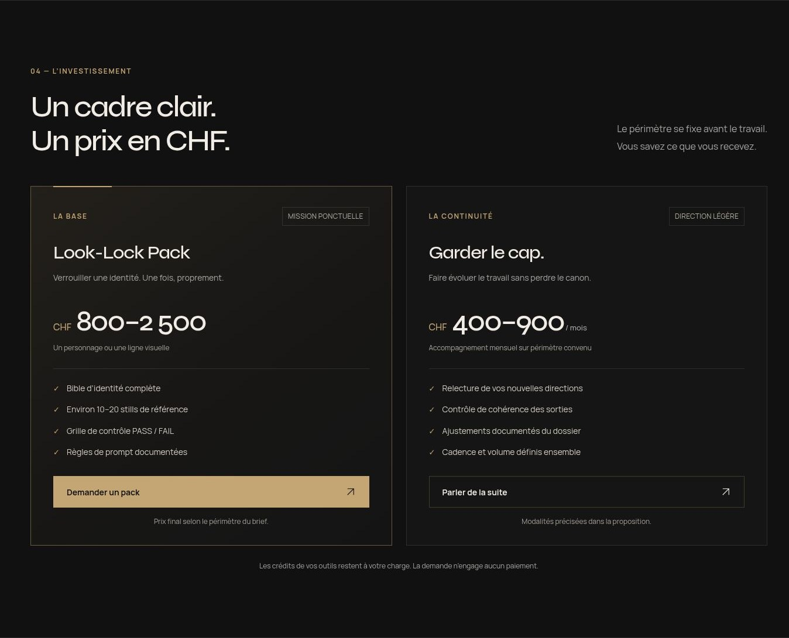

# U*TTU Studio — Look-Lock

**On verrouille l’identité. Vous arrêtez de brûler des crédits.**

Site vitrine FR-CH d’un service de direction artistique. Une commande couvre un personnage **ou** une ligne visuelle : bible d’identité, environ 10–20 stills de référence, grille PASS / FAIL et règles de prompt. Livraison en dossier.

## FAIT — Ce qui est livré

- Next.js 16.3.6, App Router, React 19.3, TypeScript strict et Tailwind CSS 4.
- Une page : hero, dérive / cohérence, livrables, méthode, tarifs, manifeste, Sanctuaire et demande.
- Palette canonique noir / anthracite / bronze / or ancien ; symbole `iii` ; Syne et Manrope auto-hébergées, sous SIL Open Font License.
- Pack : **CHF 800–2 500**. Direction légère : **CHF 400–900 / mois**.
- Formulaire nom / studio / budget / brief, préparation d’un `mailto:`, copie du brief et lien de contact direct.
- Contact provisoire : **HelveticVault@gmail.com**. Aucune demande n’est envoyée automatiquement. Aucune inscription à une waitlist n’est simulée.
- Contrôle PASS / FAIL révélable, sans analyse automatique d’images.
- Portrait, détail de peau et Sanctuaire issus des références canoniques fournies par JD. Conversion WebP sans modification du personnage ; optimisation responsive par `next/image` sur Vercel et fichiers WebP directs sur GitHub Pages. Hero préchargé, autres images différées. Provenance dans [docs/VISUAL-CANON.md](docs/VISUAL-CANON.md).
- Carte OG 1200 × 630, titre et description, favicon `iii`, `robots.txt`, sitemap et URL canonique quand l’origine est configurée.
- Animations CSS et transition native sur le contrôle ; `prefers-reduced-motion` respecté. Pas de bibliothèque 3D.
- Analytics : stub inerte dans `src/lib/analytics.ts`. Aucun SDK, cookie, stockage local ou appel de tracking.

Le site vend une méthode et un contrôle. Il ne propose ni moteur de génération, ni génération illimitée, ni vente de templates, ni produit crypto. Les crédits des outils restent à la charge du client. Stripe n’est pas intégré.

## Installer et lancer

Node.js **22 ou plus récent** et npm. Le développement et le build ont été vérifiés avec Node 24.

Le build de production utilise le bundler Webpack de Next (`next build --webpack`) pour éviter un défaut de cache persistant de Turbopack rencontré dans l’environnement de travail. Le résultat reste une application Next.js native, déployable directement sur Vercel.

```bash
git clone https://github.com/eNudimmud/U-TTU-Studio.git
cd U-TTU-Studio
npm ci
cp .env.example .env.local
npm run dev
```

Ouvrir `http://localhost:3000`.

```bash
npm run typecheck
npm run build
npm run start
```

`scripts/dev.mjs` transmet les arguments à Next et accepte les alias `--host` / `--strictPort` des environnements d’aperçu. `scripts/dev-memory.mjs` traite uniquement l’absence de `/proc` dans certains environnements de développement : les statistiques réelles de heap V8 restent disponibles, RSS indisponible = 0. Cette compatibilité ne s’active pas en production et ne modifie pas les contrôles d’accès.

## Déployer sur GitHub Pages

URL cible : **https://enudimmud.github.io/U-TTU-Studio/**.

Le workflow [.github/workflows/pages.yml](.github/workflows/pages.yml) construit l’export statique et le publie à chaque push sur `main`. Il est également déclenchable manuellement depuis Actions. Aucun secret supplémentaire n’est requis.

Activation initiale dans le dépôt : **Settings → Pages → Build and deployment → Source → GitHub Actions**. Après cette activation, relancer le workflow s’il a échoué avant la configuration de Pages. Le déploiement n’est confirmé que lorsque le job `deploy` réussit et que l’URL publique répond.

L’export utilise le sous-chemin transmis par GitHub Pages pour les images, les bundles, les polices et le favicon. Les métadonnées OG, l’URL canonique et le sitemap utilisent l’URL publique complète. Le formulaire mailto et le contrôle PASS / FAIL restent fonctionnels sans serveur.

Pour reproduire l’export localement :

```bash
GITHUB_PAGES=true \
NEXT_PUBLIC_BASE_PATH=/U-TTU-Studio \
NEXT_PUBLIC_SITE_URL=https://enudimmud.github.io/U-TTU-Studio \
npm run build
```

Le dossier `out/` contient le site statique. Ne pas utiliser `npm run start` pour cet export : il faut servir `out/` sous le même sous-chemin. Le workflow publie exclusivement `out/`, pas les sources ni la documentation interne au dépôt.

## Déployer sur Vercel

1. Dans Vercel, **Add New → Project**, importer `eNudimmud/U-TTU-Studio`.
2. Framework : **Next.js**. Racine : `.`. Branche de production : **main**.
3. Installation : `npm ci`. Build : `npm run build`. Laisser le dossier de sortie sur le réglage Next.js par défaut.
4. Configurer les variables ci-dessous, puis **Deploy**.
5. Après attribution du domaine, renseigner `NEXT_PUBLIC_SITE_URL` avec l’URL HTTPS finale et redéployer. Vérifier le lien e-mail depuis le domaine public.

| Variable | Valeur / comportement |
| --- | --- |
| `NEXT_PUBLIC_SITE_URL` | URL HTTPS publique, sans chemin. Facultative sur Vercel : les variables système `VERCEL_PROJECT_PRODUCTION_URL` puis `VERCEL_URL` servent de repli. À définir pour un domaine personnalisé. |
| `NEXT_PUBLIC_CONTACT_EMAIL` | `HelveticVault@gmail.com` par défaut ; adresse provisoire à remplacer si nécessaire. |
| `NEXT_PUBLIC_BASE_PATH` | Vide sur Vercel ; transmis par GitHub Pages pour le sous-chemin du dépôt. |
| `GITHUB_PAGES` | `true` dans le workflow Pages, `false` ou absent sur Vercel. Active l’export statique et les images locales sans serveur d’optimisation. |

Aucun secret requis. Sans origine configurée hors Vercel, les métadonnées de développement utilisent `http://localhost:3000` ; aucune URL publique n’est inventée. Le sitemap reste vide jusqu’à configuration d’une origine.

La configuration Vercel reste disponible indépendamment du workflow GitHub Pages.

## Sources canoniques

Lues avant l’implémentation, dans cet ordre :

1. [U-TTU](https://github.com/eNudimmud/U-TTU) : `SOUL.md`, `knowledge/13-CANON-VISUEL.md`, `knowledge/14-SANCTUAIRE.md`, `knowledge/02-PHILOSOPHIE.md`.
2. [U-TTU-Vault](https://github.com/eNudimmud/U-TTU-Vault) : `00_IDENTITY/IDENTITE.md`.
3. [U-TTU-Studio](https://github.com/eNudimmud/U-TTU-Studio) : dépôt cible ; tout le code du site est ici.

Les sources et le Vault n’ont pas été modifiés. Les choix et limites sont consignés dans [docs/DECISIONS.md](docs/DECISIONS.md).

**Correction de DA :** les visuels générés de la première livraison ont été rejetés par JD. Ils ont été retirés. Les images affichées d’U*TTU proviennent maintenant directement de ses références ; la comparaison expose les invariants et les critères de refus du personnage.

## Description visuelle de la livraison

Hero — portrait canonique fourni par JD, promesse, CTA et prix :


Tarifs — pack initial et direction mensuelle, sans paiement immédiat :



Mobile — même hiérarchie dans un viewport étroit :


## Vérification

Voir [docs/QA.md](docs/QA.md) : build, responsive, formulaire, clavier, contraste et limites de mesure.

## PROPOSITION — Après la V1

- Ajouter un cas client autorisé, avec écarts annotés et validation documentée, en complément des références U*TTU.
- Brancher un envoi serveur ou une vraie waitlist avec consentement explicite si le flux e-mail devient insuffisant.
- Ajouter EN ou une page `/gate` uniquement lorsque la demande le justifie.

Ces propositions ne constituent ni de nouvelles offres ni des fonctionnalités déjà livrées.
