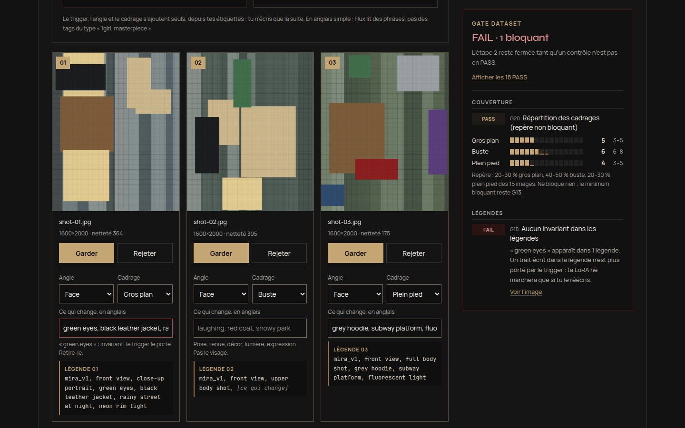
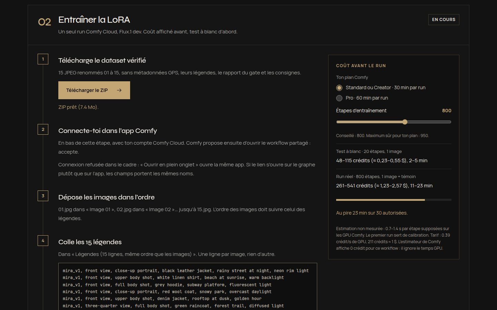
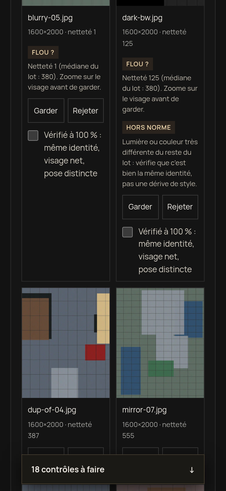

# U*TTU Studio — C micro

> **On t’empêche de cramer une LoRA. Dataset → train → 1 image.**

Site vitrine et outil guidé, en français (FR-CH), pour une seule offre : entraîner une LoRA de personnage sans la rater. Le site vérifie le dataset dans le navigateur et bloque l’entraînement tant qu’il reste un problème. Il prépare ensuite un seul run Comfy Cloud (Flux.1 [dev]) qui entraîne la LoRA et rend une image, avec le coût affiché avant.

## Date de kill : 8 octobre 2026

| Règle | Valeur |
| --- | --- |
| Démarrage | 24 septembre 2026 |
| Date de kill | **8 octobre 2026** (J+14) |
| Condition de survie | **1 client payant** avant cette date |
| Sinon | C micro est arrêté, comme l’offre A |
| Qui décide | JD, le 8 octobre, sans prolongation par défaut |

L’offre A (« Look-Lock » : forfait de direction artistique et ZIP-juge) a été arrêtée le 24 septembre 2026. Elle ne figure plus nulle part sur le site et n’a pas de page d’archive. Son code reste dans l’historique git, jusqu’au commit `9fca7e5`.

## Ce que fait le site

1. **Dataset propre.** Le client choisit un trigger, liste les traits qui ne changent jamais et importe ses images. Le site mesure localement la résolution, la netteté, les doublons, les copies en miroir et les couleurs hors norme. Le client trie chaque image, indique l’angle et le cadrage, décrit ce qui varie et coche 5 confirmations. Les 19 contrôles doivent être en PASS pour passer à la suite ([règles détaillées](docs/DATASET-GATE.md)).
2. **Entraîner la LoRA.** Le site fournit un ZIP (15 JPEG nettoyés, légendes, rapport), le lien de l’app Comfy et les légendes à coller. Il affiche le coût estimé et refuse un réglage qui dépasserait la durée maximale d’un run Comfy. Un test à blanc à 20 étapes passe avant le vrai run.
3. **Utiliser une fois : 1 image.** Le client règle prompt, force de la LoRA, seed et nombre d’images (1 ou 4). Ces réglages vont dans le même formulaire Comfy que l’entraînement, car la LoRA n’existe que pendant le run (voir plus bas). Le run rend aussi une image témoin sans LoRA et la courbe de loss, et le site aide à lire le résultat.

**Hors périmètre :** Look-Lock et ZIP-juge, vidéo (clips, storyboards, pubs), 3D, voix, avatars, plateforme d’identité, menu combinant plusieurs offres, autre moteur d’entraînement que Comfy Cloud.

## Démarrer

Prérequis : Node.js 22 ou plus récent, et npm.

```bash
git clone https://github.com/eNudimmud/U-TTU-Studio.git
cd U-TTU-Studio
npm ci
cp .env.example .env.local
npm run dev          # http://localhost:3000
```

| Commande | Rôle |
| --- | --- |
| `npm test` | 38 tests : règles du gate, légendes, mesures d’image, ZIP (vérifié par `unzip -t`), cohérence des workflows Comfy, coûts et plafond de durée. |
| `npm run typecheck` | TypeScript strict. |
| `npm run build` | Build de production (`next build --webpack`). |
| `npm run comfy:build` | Régénère `comfy/*.api.json` à partir de `src/lib/comfy-stack.ts`. |

## Workflows Comfy Cloud

**Une seule stack : Flux.1 [dev].** Fichiers `flux1-dev.safetensors`, `clip_l.safetensors`, `t5xxl_fp16.safetensors` et `ae.safetensors`, tous présents sur Comfy Cloud. L’entraînement utilise le node officiel `TrainLoraNode` : rank 16, AdamW, learning rate 4e-4, images réduites à 0,25 mégapixel, 800 étapes par défaut. Flux a été préféré à SDXL pour la fidélité des visages ; le détail est dans [docs/COMFY-STACK.md](docs/COMFY-STACK.md).

**Pourquoi entraînement et image partent dans le même run.** Comfy Cloud ne propose pas le node qui enregistre une LoRA (`SaveLoRA`, vérifié le 24 septembre 2026). Une LoRA entraînée sur Cloud ne peut donc pas être téléchargée ni réutilisée dans un autre workflow. Le workflow principal entraîne la LoRA puis s’en sert aussitôt pour produire l’image : c’est exactement « 1 image d’usage ».

| Workflow | Rôle | App Mode | Fichier à importer |
| --- | --- | --- | --- |
| Dataset → LoRA → 1 image | Entraîne la LoRA et rend 1 à 4 images, le témoin sans LoRA et la courbe de loss. | [ouvrir](https://cloud.comfy.org/?share=798eb224b972) | [`public/comfy/c-micro-train-image.json`](public/comfy/c-micro-train-image.json) |
| Test de prompt sans LoRA | Règle la scène, le cadrage et la seed pour quelques crédits, avant de payer l’entraînement. | [ouvrir](https://cloud.comfy.org/?share=25954f3b0278) | [`public/comfy/c-micro-prompt-test.json`](public/comfy/c-micro-prompt-test.json) |

Le **test à blanc** n’est pas un troisième workflow. C’est le premier, lancé avec 20 étapes et 1 image, qui sont ses valeurs par défaut. Les images déposées restent en place pour le vrai run.

### Créer les workflows dans Comfy Cloud

1. Se connecter à [cloud.comfy.org](https://cloud.comfy.org) avec un compte qui a des crédits.
2. Ouvrir `public/comfy/c-micro-prompt-test.json` comme workflow. Le fichier contient déjà la configuration App Mode : entrées « Prompt » et « Seed », sortie « Test de prompt sans LoRA ».
3. Ouvrir `public/comfy/c-micro-train-image.json` de la même façon. Entrées, dans l’ordre : « Image 01 » à « Image 15 », « Légendes », « Étapes d’entraînement », « Prompt », « Force LoRA », « Seed », « Nombre d’images ». Sorties : « Avec LoRA », « Témoin sans LoRA », « Courbe de loss ».
4. Partager chaque workflow pour obtenir un lien `https://cloud.comfy.org/?share=…`.
5. Mettre ces liens dans `NEXT_PUBLIC_COMFY_TRAIN_APP_URL` et `NEXT_PUBLIC_COMFY_PROMPT_APP_URL`, ou dans `COMFY_APPS` (`src/lib/comfy-stack.ts`), puis reconstruire le site.

Comfy précise qu’un lien de partage peut s’ouvrir sur le graphe plutôt que sur l’app. Les champs portent alors les mêmes noms. Ce comportement reste à vérifier au premier clic.

### Modifier la stack

Tous les réglages sont dans `src/lib/comfy-stack.ts`. Après une modification :

1. `npm run comfy:build` régénère les graphes au format API.
2. Les valider avec Comfy en mode `dry_run` : contrôle sans exécution, 0 crédit.
3. Les sauvegarder dans Comfy Cloud, configurer l’App Mode et récupérer les liens de partage.
4. Copier les versions sauvegardées dans `public/comfy/`.
5. `npm test` vérifie que ces fichiers correspondent au code, node par node.

La procédure complète, avec les outils du MCP Comfy Cloud, est dans [docs/COMFY-STACK.md](docs/COMFY-STACK.md#recréer-les-workflows-2-minutes-sans-gpu).

## Tester avant de payer

Du moins cher au plus cher. Les crédits Comfy sont à la charge du client : environ 0,39 crédit par seconde de GPU, 211 crédits ≈ 1 $.

| Étape | Coût | Ce qu’elle prouve |
| --- | --- | --- |
| `npm test` | 0 | Le gate, le ZIP, la cohérence des workflows et le plafond de durée. |
| Validation Comfy `dry_run` | 0 | Le graphe est accepté par Comfy Cloud. |
| Test de prompt sans LoRA | 7–29 crédits | Scène, cadrage et seed. |
| Test à blanc (20 étapes, 1 image) | 48–115 crédits, 2 à 5 min | Images, légendes, entraînement et rendu s’enchaînent sans erreur. |
| Run réel (800 étapes, 1 image + témoin) | 261–541 crédits (≈ 1,23–2,57 $), 11 à 23 min | La LoRA et son image. |

Ces montants sont des **estimations non mesurées** : aucun run n’a encore été lancé, donc 0 crédit dépensé à ce jour. Le premier test à blanc et le premier run réel servent de calibration. Il faut ensuite reporter les durées mesurées dans `TIMING` (`src/lib/comfy-stack.ts`) et passer `measured` à `true` ([procédure](docs/COMFY-STACK.md#coût--modèle-et-calibration)).

Un run Comfy est coupé au bout de 30 minutes en Standard et Creator, 60 minutes en Pro. Le site refuse donc plus de 950 étapes en Standard (900 avec 4 images) et plus de 2 100 en Pro. L’estimateur intégré à Comfy annonce 0 crédit pour ces workflows, parce qu’il ne compte pas le temps GPU.

## Prix — proposition non vérifiée

**CHF 49 à 149 pour un run guidé**, ou **crédits Comfy du client + frais de guidage**. Le site l’affiche comme « prix pressenti, non confirmé » et ne facture rien. Décision à prendre par JD avant la date de kill.

## Déployer

**GitHub Pages.** Chaque push sur `main` lance le workflow [pages.yml](.github/workflows/pages.yml) : installation, tests, export statique, puis publication sur **https://enudimmud.github.io/U-TTU-Studio/**. La version en ligne est toujours celle de `main`. Le site fonctionne sans serveur : analyse des images, ZIP et formulaire tournent dans le navigateur. Pour reproduire l’export en local :

```bash
GITHUB_PAGES=true NEXT_PUBLIC_BASE_PATH=/U-TTU-Studio NEXT_PUBLIC_SITE_URL=https://enudimmud.github.io/U-TTU-Studio npm run build
# résultat dans out/, à servir sous /U-TTU-Studio/
```

**Vercel.** Importer le dépôt comme projet Next.js (`npm ci`, `npm run build`).

| Variable | Rôle |
| --- | --- |
| `NEXT_PUBLIC_SITE_URL` | URL publique HTTPS, pour la carte OG, l’URL canonique et le sitemap. Facultative sur Vercel. |
| `NEXT_PUBLIC_CONTACT_EMAIL` | Adresse de contact. `HelveticVault@gmail.com` par défaut, provisoire. |
| `NEXT_PUBLIC_COMFY_TRAIN_APP_URL`, `NEXT_PUBLIC_COMFY_PROMPT_APP_URL` | Facultatives : remplacent les liens App Mode. |
| `NEXT_PUBLIC_BASE_PATH`, `GITHUB_PAGES` | Réservées à l’export GitHub Pages. |

Aucun secret n’est nécessaire. Le site n’appelle pas l’API Comfy : il est statique, et cette API demande un plan Creator ou Pro avec une clé côté serveur. Le client lance le run lui-même, sur son compte Comfy.

## Confidentialité

- Les images sont analysées et converties dans le navigateur du client. Rien n’est envoyé au studio.
- Le ZIP est créé localement. Le réencodage en JPEG retire les métadonnées EXIF, localisation GPS comprise.
- Les images n’arrivent chez Comfy que lorsque le client les dépose lui-même dans l’app.
- Le formulaire d’accès anticipé prépare un e-mail (`mailto:`), sans envoi automatique.
- Aucun cookie, aucun stockage local, aucun outil de mesure d’audience (`src/lib/analytics.ts` est inerte).

## Organisation du code

```text
src/app/page.tsx              page unique : hero, piège, parcours, coût, accès anticipé
src/components/guide/         parcours en 3 étapes
src/lib/gate/                 règles du gate, légendes, mesures d’image, rapport, export ZIP
src/lib/comfy-stack.ts        réglages Flux.1 dev, coûts, durées, liens App Mode
src/lib/comfy-workflows.ts    générateur des graphes Comfy
comfy/*.api.json              graphes générés, format API
public/comfy/*.json           graphes tels que sauvegardés dans Comfy Cloud, avec App Mode
tests/                        tests unitaires (node --test)
docs/                         documentation
```

## Documentation

| Document | Contenu |
| --- | --- |
| [docs/DATASET-GATE.md](docs/DATASET-GATE.md) | Les 19 contrôles, leurs seuils et le contenu du ZIP. |
| [docs/COMFY-STACK.md](docs/COMFY-STACK.md) | Choix de Flux, faits vérifiés sur Comfy Cloud, graphes, calcul du coût, calibration, risques. |
| [docs/DECISIONS.md](docs/DECISIONS.md) | Registre des faits, hypothèses, propositions et décisions. |
| [docs/QA.md](docs/QA.md) | Contrôles exécutés avant livraison, et leurs limites. |
| [docs/VISUAL-CANON.md](docs/VISUAL-CANON.md) | Direction artistique U*TTU et provenance du portrait. |

## Captures


Une légende réécrit un invariant (« green eyes ») : le gate passe en FAIL et l’étape 2 se referme.



Étape 2 : ZIP, lien vers l’app Comfy, coût estimé et plafond de durée.



Sur mobile, le verdict du gate reste visible en bas de l’écran pendant le tri.

 

Les captures du parcours utilisent des images de test synthétiques, générées avec ffmpeg. Ce ne sont pas des résultats d’entraînement.
