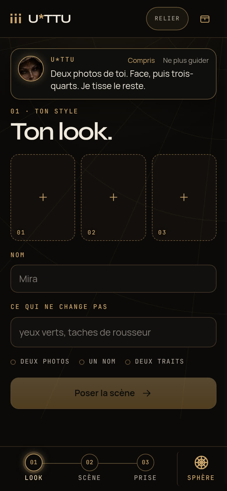
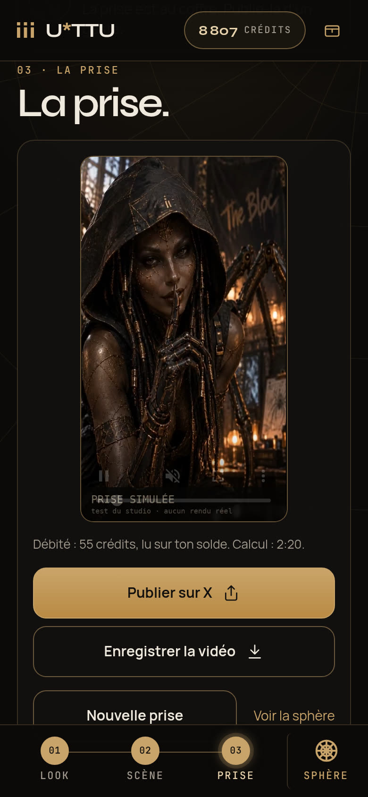

# U*TTU Studio

> **Ton style. Ta scène. La prise.** Un studio vidéo dans la poche.

Site en français (FR-CH). `/studio` est une app : on tient un look, on pose une scène, on tourne une prise vidéo, on la voit, on la publie, sans quitter la page. Le rendu tourne dans le cloud, sur le compte Comfy Cloud de la personne. Le studio ne vend rien, ne garde aucun compte de visiteur, et ne voit pas les fichiers : ils vivent dans un coffre Obsidian sur l’appareil.

**Vente HOLD.** Aucune prise réelle n’a été tournée par les livraisons : 0 crédit dépensé. La première prise d’un compte calibre le coût affiché.

## Date de kill : 8 octobre 2026

| Règle | Valeur |
| --- | --- |
| Démarrage | 24 septembre 2026 |
| Date de kill | **8 octobre 2026** (J+14) |
| Condition de survie | **1 CHF payant** avant cette date (passation JD du 25 septembre) |
| Sinon | C micro est arrêté, comme l’offre A |
| Qui décide | JD, le 8 octobre, sans prolongation par défaut |

L’offre A (« Look-Lock ») a été arrêtée le 24 septembre 2026. Son code reste dans l’historique git, jusqu’au commit `9fca7e5`.

## L’app

Trois gestes en bas de l’écran, reliés par un fil d’or, et Sphère à côté. Une action principale par écran.

1. **Look.** Deux ou trois photos de soi, un nom, deux traits qui ne bougent pas. Les photos sont réduites dans le navigateur (1 536 px, JPEG) et rangées au coffre.
2. **Scène.** Un lieu : un nom, une note, une ou deux images. Plusieurs lieux possibles, un lieu courant.
3. **Prise.** Une phrase : ce que fait le plan. Format 9:16, 16:9 ou 1:1 ; 5 ou 8 s. « Références » tourne sur Comfy (rapide 4 pas ou fin 20 pas). « Ton double » recharge le fichier formé, sur fal, en 768p ou 480p. « Tourner » ouvre une confirmation avec le solde lu à l’instant. Après le geste, le studio envoie les photos, met la prise en file sur le compte qui paie, suit le calcul, rapatrie la vidéo dans le coffre et lit le débit.
4. **Ton double.** Une page à part (`#lora`), pas un réglage de Ton style. Elle dit, avant tout geste payant, ce que les clips doivent être, ce que le fichier fera et ne fera pas dans La prise, et combien cela coûte. Le fichier `.safetensors` revient au coffre et se choisit ensuite dans La prise.
5. **Publier.** Sur téléphone, la feuille de partage de l’appareil reçoit la vidéo et le texte : X en un geste. Sur ordinateur, « Enregistrer la vidéo » et le brouillon X avec le texte. Rien n’est publié sans le geste dans X.
6. **Sphère.** L’étagère des prises du coffre, avec une vignette décodée de chaque vidéo. Une prise s’ouvre en lecteur, se publie, ou se retire.

Une prise en cours survit à un rechargement ou à un changement d’app : le studio reprend le suivi du même job. L’écran reste allumé pendant le calcul quand le navigateur le permet.

### Le moteur

La prise est un graphe MiniMax H3 Reference-to-Video (`minimax_h3_ref2va_pruned_int8_convrot`) construit par [`src/lib/render/take-graph.ts`](src/lib/render/take-graph.ts) : jusqu’à 9 images de référence nommées `<Picture N>`, le texte de la prise, 24 images/s, MP4 H.264. Le graphe a passé la validation `dry_run` de Comfy Cloud (0 crédit, aucun job). Le studio l’envoie par l’API documentée de Comfy Cloud : `POST /api/upload/image`, `POST /api/prompt`, `GET /api/job/{id}/status`, `GET /api/jobs/{id}`, `GET /api/view`. `cloud.comfy.org` n’envoie pas d’en-têtes CORS pour ce domaine : les appels passent par le relais même origine du studio ([`src/lib/comfy-proxy.ts`](src/lib/comfy-proxy.ts)), qui transmet et ne garde rien. Détail : [docs/COMFY-STACK.md](docs/COMFY-STACK.md).

### Relier son compte de rendu

Dans la feuille « Relier », deux chemins :

- **Me connecter ici.** La page de connexion de Comfy s’ouvre dans la feuille, sur le domaine du studio. La session reste sur l’appareil. Cette page charge ses propres traceurs (Google, LinkedIn) : rien n’est chargé avant le geste.
- **J’ai une clé.** Une clé API Comfy Cloud (abonnement payant), vérifiée par `GET /api/user`, gardée sur l’appareil. Aucun code tiers ne se charge.

### Crédits — un seul payeur

- Le payeur est le compte Comfy Cloud de la personne. Le compteur en haut à droite est son solde, lu chez Comfy (`api.comfy.org/customers/balance` en session, `GET /api/billing/usage/timeseries` en clé). 211 crédits = 1 $.
- Le coût d’une prise est **mesuré** : le solde juste avant, puis après. Il est écrit dans la fiche de la prise et dans `jobs.md`.
- À un réglage donné (pas, durée, format), le studio annonce « environ X crédits » seulement après une prise mesurée à ce réglage : la plus chère des trois dernières. Avant, il dit « non calibré » et n’annonce aucun chiffre.
- « Tourner » s’éteint si le solde est illisible, vide, ou sous le coût mesuré. Rien ne part sans le geste de confirmation. Le studio n’encaisse rien et ne recharge rien.
- **Ton double a son propre payeur : le compte fal de la personne.** Le compteur du haut montre ce solde sur la page de formation et quand La prise est sur « Ton double », et les crédits Comfy le reste du temps. Le devis vient du prix unitaire du compte, avant le geste. « Former » et « Tourner » s’éteignent si ce solde est illisible, vide, ou sous le devis. Le vieux rail Flux (Worker, `src/lib/fal-*.ts`) reste dormant : il n’entraîne pas le modèle de La prise.
- **Délier** se fait dans cette même feuille « Comptes », un bouton par compte. Ça retire la clé ou la session de cet appareil. Le coffre, le fichier formé et le compte chez Comfy ou fal restent.

### Coffre — la mémoire du studio

Le coffre est un dossier Obsidian, tenu par l’app dans le stockage de l’appareil (IndexedDB), rangé ainsi :

```text
U-TTU-Studio/
  CANON.md            le look : nom, traits, photos
  refs/               les photos du look
  scenes/<lieu>.md    chaque lieu, ses images à côté
  clips/              les courtes vidéos dont le double apprend
  loras/<id>.safetensors  le fichier formé, et sa fiche .md
  prises/<id>.md      chaque prise : plan, réglage, job, coût mesuré
  prises/<id>.mp4     la vidéo, et sa vignette .jpg
  jobs.md             le journal : une ligne par prise et par formation
  README.md
```

« Exporter le coffre » télécharge `U-TTU-Studio.zip`, à ouvrir tel quel dans Obsidian. Sur ordinateur (Chrome, Edge), « Relier mon dossier Obsidian » écrit directement dans un dossier choisi. Ni la clé de rendu, ni la clé fal, n’entrent dans le coffre. Pourquoi ce coffre plutôt qu’un ZIP de départ : [docs/VAULT.md](docs/VAULT.md).

### U*TTU, la guide

U*TTU dit une phrase à chaque moment où l’on peut hésiter : photos, nom, traits, lieu, relier, phrase, coût, calcul, publication. Une bulle au-dessus du fil, pas un mode d’emploi. « Compris » la range ; « Ne plus guider » la coupe. Son visage est un recadrage du portrait canon ([docs/VISUAL-CANON.md](docs/VISUAL-CANON.md)).

### Captures

Parcours vérifié le 3 octobre 2026 avec un compte de rendu simulé : la vidéo est un clip de test (« Prise simulée »), le coût et le solde viennent du faux compte. Aucune prise réelle.

 

## Ce qui quitte encore l’app

| Quoi | Pourquoi |
| --- | --- |
| Recharger des crédits | Le payeur est le compte Comfy de la personne. Le studio ne vend pas de crédits. |
| Créer une clé API (chemin « clé » seulement) | Une fois, sur `platform.comfy.org`. Le chemin « Me connecter ici » n’en a pas besoin. |
| Créer un compte fal, le recharger, créer une clé Admin | Une fois, sur fal.ai. La formation et « Ton double » tournent sur ce compte. La clé se colle dans le studio et n’en sort plus. |
| Joindre la vidéo dans X sur ordinateur | Les navigateurs de bureau ne partagent pas un fichier vers X. Sur téléphone, la feuille de partage le fait en un geste. |
| Compte U*TTU (`/compte`) | Facultatif, hors du chemin. Le studio n’en a pas besoin. |

**Former son double et le recharger dans La prise** se fait sur le compte fal de la personne, pas sur Comfy Cloud. Comfy ne sait toujours pas enregistrer un LoRA formé ni le recharger depuis un fichier personnel. Le studio envoie des clips à `minimax/h3/ref2va/trainer`, range le `.safetensors` au coffre, et La prise « Ton double » le recharge via `minimax/h3/reference-to-video/lora`. Détail : [docs/COMFY-STACK.md](docs/COMFY-STACK.md#un-double-formé-par-ladhérent--fal-pas-comfy-cloud-3-octobre-2026).

## Démarrer

Prérequis : Node.js 22 ou plus récent, et npm.

```bash
git clone https://github.com/eNudimmud/U-TTU-Studio.git
cd U-TTU-Studio
npm ci
cp .env.example .env.local
npm run dev          # http://localhost:3000
```

| Commande | Rôle |
| --- | --- |
| `npm test` | Graphe de prise (comparé au graphe validé en `dry_run`), client de rendu contre un faux Comfy Cloud, coût mesuré et porte de lancement, coffre Obsidian et son ZIP, session, relais Comfy, Clerk hors du studio, et les bibliothèques dormantes. |
| `npm run typecheck` | TypeScript strict. |
| `npm run build` | Build de production (`next build --webpack`). |
| `npm run fal:smoke -- /chemin/dataset.zip` | Dormant. Vérifie un ZIP de dataset contre le rail fal ; dry par défaut, 0 réseau, 0 $. |

En local, le chemin « Me connecter ici » se teste en HTTPS : la page de connexion Comfy pose des cookies `Secure`. Le chemin par clé marche aussi sur `next dev`.

## Déployer

**Vercel, cible officielle.** Importer le dépôt comme projet Next.js (`npm ci`, `npm run build`). Le relais Comfy et Clerk ont besoin de ce runtime. GitHub Pages ne publie plus ([pages.yml](.github/workflows/pages.yml) vérifie seulement tests, types et build).

Aucun secret n’est nécessaire pour l’app : chaque personne relie son propre compte de rendu.

| Variable | Rôle |
| --- | --- |
| `NEXT_PUBLIC_SITE_URL` | URL publique HTTPS, pour la carte OG, l’URL canonique et le sitemap. Facultative sur Vercel. |
| `NEXT_PUBLIC_CONTACT_EMAIL` | Adresse de contact. `HelveticVault@gmail.com` par défaut, provisoire. |
| `NEXT_PUBLIC_CLERK_PUBLISHABLE_KEY`, `CLERK_SECRET_KEY` | Compte U*TTU facultatif. Vides : build vert, `/compte` dit « fermés pour l’instant ». Ne pas committer les valeurs ([AUTH.md](docs/AUTH.md)). |
| `NEXT_PUBLIC_CLERK_SIGN_IN_URL`, `NEXT_PUBLIC_CLERK_SIGN_UP_URL` | `/sign-in` et `/sign-up`. |
| `NEXT_PUBLIC_CLERK_SIGN_IN_FALLBACK_REDIRECT_URL`, `NEXT_PUBLIC_CLERK_SIGN_UP_FALLBACK_REDIRECT_URL` | `/compte`. |
| `NEXT_PUBLIC_BASE_PATH` | Vide sur Vercel. |
| `NEXT_PUBLIC_COMFY_*_APP_URL`, `NEXT_PUBLIC_FAL_PROXY_URL` | Dormantes : l’app ne les lit plus. |

## Confidentialité

- Les photos sont réduites et réencodées dans le navigateur (les métadonnées EXIF, GPS compris, disparaissent), puis rangées dans le coffre de l’appareil.
- Elles ne partent qu’au geste « Tourner », vers le compte de rendu de la personne, par le relais du studio. Le relais transmet et ne garde rien.
- La clé ou la session de rendu reste sur l’appareil. Elle n’entre pas dans le coffre ni dans son export.
- Aucun outil de mesure d’audience. Aucune base de comptes du studio. Clerk ne se charge que sur `/compte`, `/sign-in` et `/sign-up`, télémétrie coupée : `/` et `/studio` ne posent aucun cookie Clerk.
- La page de connexion Comfy charge ses traceurs, sur le domaine du studio, seulement après le geste « Ouvrir la connexion ». Le chemin par clé ne charge aucun code tiers.
- Le lien de contact ouvre la messagerie (`mailto:`), sans envoi automatique.

## Organisation du code

```text
src/app/studio/page.tsx        l’app
src/app/compte/page.tsx        compte U*TTU facultatif (Clerk)
src/app/page.tsx               accueil : une ligne, trois gestes, une porte
src/components/app/            écrans, feuilles, guide, publication, styles de l’app
src/lib/render/                client Comfy Cloud, graphe H3, texte de prise, suivi, session, réglages
src/lib/credits.ts             solde Comfy, devis fal, portes de lancement
src/lib/fal/                   compte fal de l’adhérent : solde, prix, file, envoi
src/lib/lora/                  clips, formation H3, prise qui recharge le fichier
src/lib/coffre/                coffre : stockage, markdown, modèle, export ZIP, dossier relié
src/lib/guide.ts               les répliques d’U*TTU
src/lib/comfy-proxy.ts         relais même origine vers cloud.comfy.org, médias /api/view
src/lib/comfy-media.ts         script des pages Comfy relayées (médias, porte de lancement)
src/proxy.ts                   relais, puis Clerk sur /compte, /sign-in, /sign-up
src/lib/fal-*.ts, src/lib/gate/, workers/fal-proxy/   rail Flux, dormant : l’app ne l’appelle plus
tests/                         node --test
docs/                          documentation
```

## Documentation

| Document | Contenu |
| --- | --- |
| [docs/DECISIONS.md](docs/DECISIONS.md) | Registre des faits, hypothèses, propositions et décisions. |
| [docs/COMFY-STACK.md](docs/COMFY-STACK.md) | La prise par l’API Comfy Cloud, le graphe H3, les crédits mesurés ; l’ancienne stack Flux, dormante. |
| [docs/VAULT.md](docs/VAULT.md) | Le coffre : schéma, stockage, export, dossier relié, et pourquoi ce choix. |
| [docs/VISUAL-CANON.md](docs/VISUAL-CANON.md) | Direction artistique U*TTU, palette, guide, provenance du portrait. |
| [docs/AUTH.md](docs/AUTH.md) | Clerk sur `/compte`, Vercel, variables, mode dégradé sans clés. |
| [docs/LANDING-AND-UX.md](docs/LANDING-AND-UX.md) | Doctrine de l’accueil et de l’app : un geste, mobile d’abord, accès. |
| [docs/CINEMA-STUDIO-BRIEF.md](docs/CINEMA-STUDIO-BRIEF.md) | Le verrou Look → Scène → Prise et son historique. |
| [docs/QA.md](docs/QA.md) | Contrôles exécutés avant livraison, et leurs limites. |
| [docs/DATASET-GATE.md](docs/DATASET-GATE.md), [docs/FAL-SPIKE.md](docs/FAL-SPIKE.md), [workers/fal-proxy/README.md](workers/fal-proxy/README.md) | Le gate de dataset et le rail fal, dormants. |

## JD — ce qui reste à faire

1. Rien à brancher pour l’app : pas de secret, pas de Worker.
2. La première vraie prise, sur un compte Comfy Cloud avec des crédits, est le premier test réel du chemin complet (relais, file, vidéo, débit). Elle calibre aussi le coût affiché à ce réglage.
3. Facultatif : les clés Clerk, si un compte U*TTU doit exister ([AUTH.md](docs/AUTH.md)).
