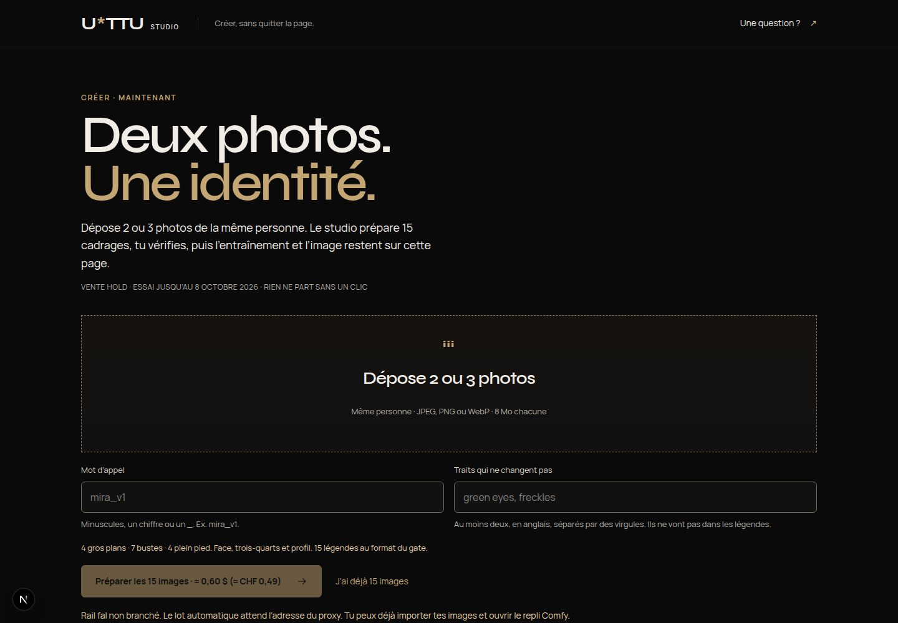
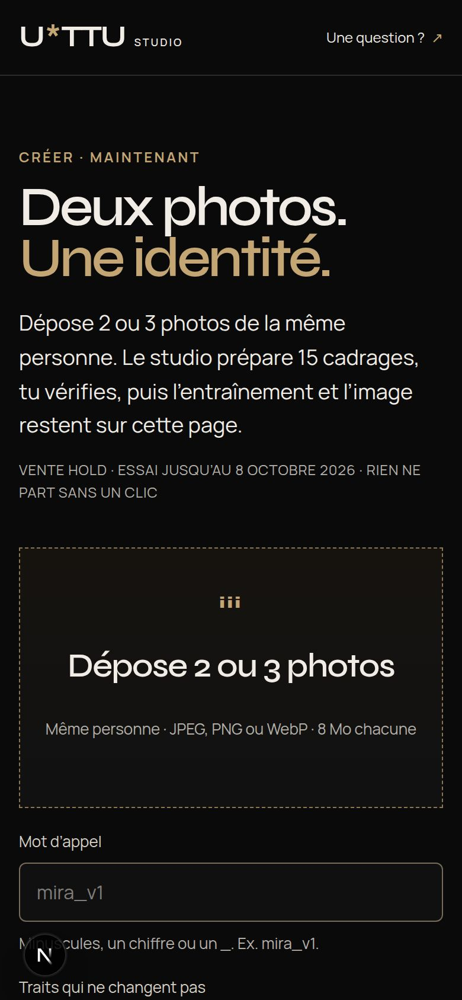
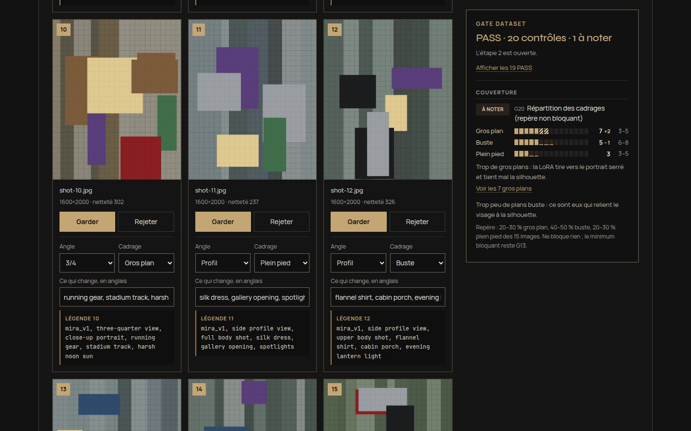
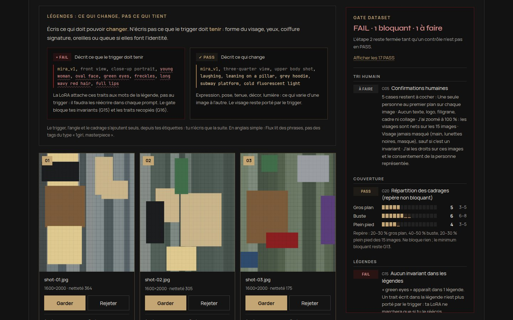
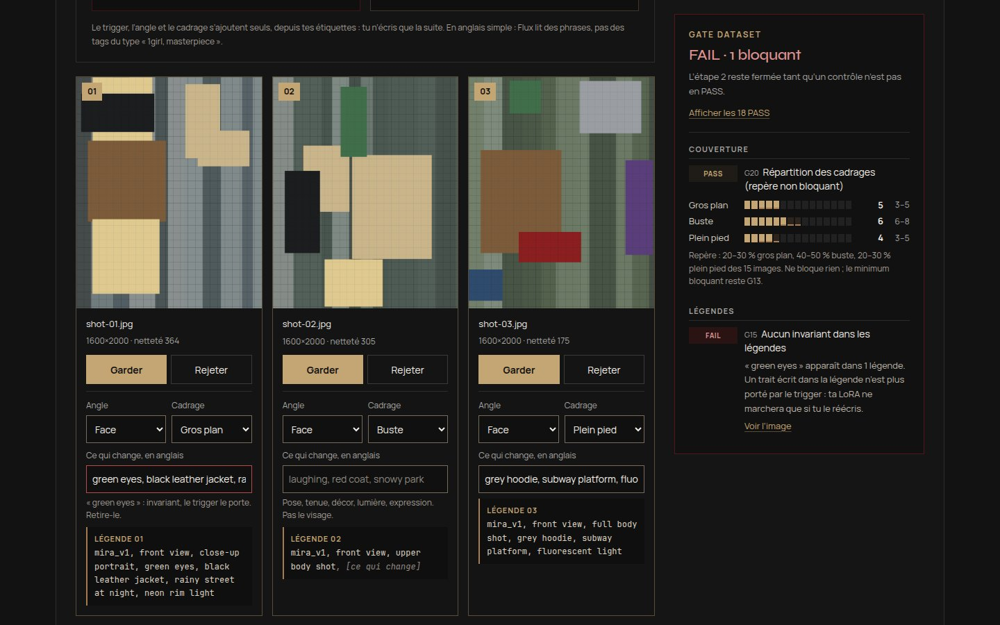
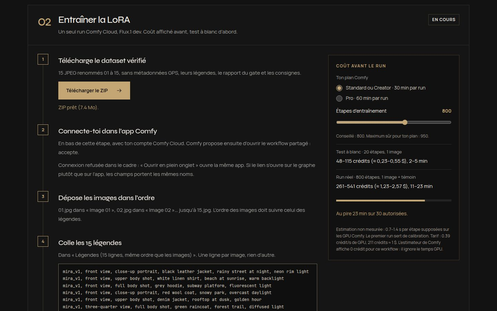
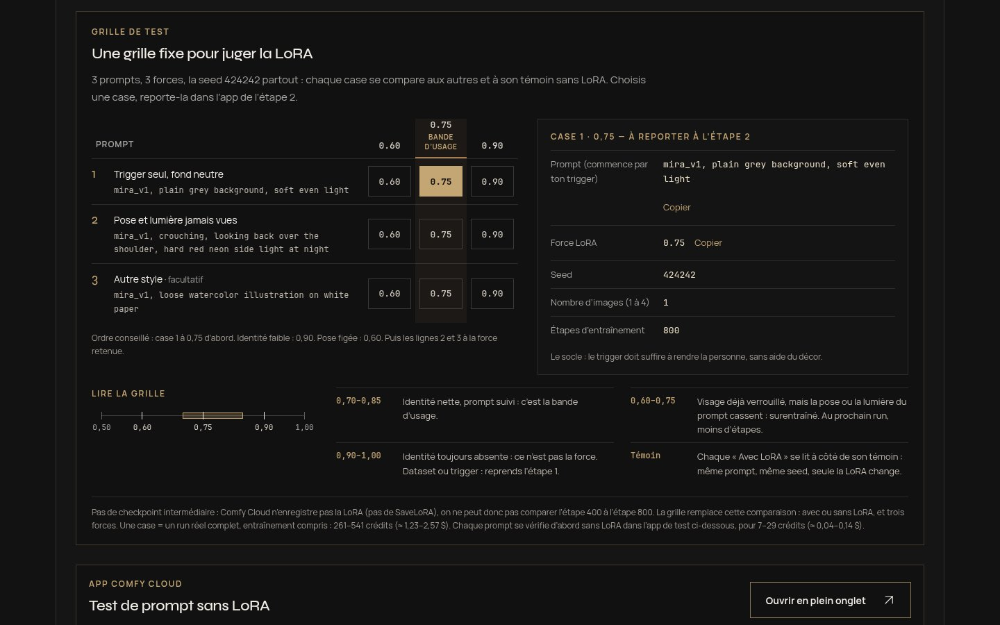
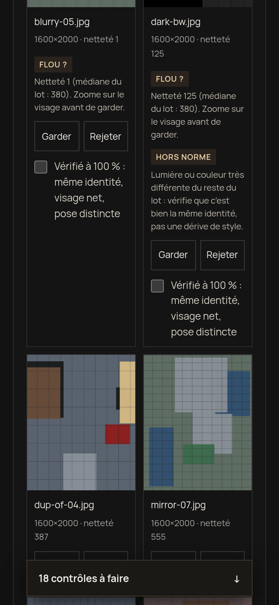

# U*TTU Studio — C micro

> **Ton style. Ta scène. La prise.** Tourner dans un monde.

Site en français (FR-CH) pour C micro : 2 ou 3 photos → lot de 15 images → LoRA → image(s). Le gate reste dans le navigateur et bloque l’entraînement tant qu’il reste un problème. Le chemin principal est le rail fal, dans la page, quand `NEXT_PUBLIC_FAL_PROXY_URL` est défini. Comfy Cloud est un repli replié, « Expert ». **Vente HOLD.** L’identité produite n’est pas encore validée.

**État fal :** le code du proxy et du bootstrap est dans le dépôt. Le Worker n’a pas été déployé par cette livraison. Tant que `NEXT_PUBLIC_FAL_PROXY_URL` est vide, le bouton de lot est inactif (« proxy non branché »). [Contrat](docs/FAL-SPIKE.md) · [déploiement Worker](workers/fal-proxy/README.md#déployer-via-github-actions).

## Date de kill : 8 octobre 2026

| Règle | Valeur |
| --- | --- |
| Démarrage | 24 septembre 2026 |
| Date de kill | **8 octobre 2026** (J+14) |
| Condition de survie | **1 CHF payant** avant cette date (passation JD du 25 septembre) |
| Sinon | C micro est arrêté, comme l’offre A |
| Qui décide | JD, le 8 octobre, sans prolongation par défaut |

L’offre A (« Look-Lock » : forfait de direction artistique et ZIP-juge) a été arrêtée le 24 septembre 2026. Elle ne figure plus nulle part sur le site et n’a pas de page d’archive. Son code reste dans l’historique git, jusqu’au commit `9fca7e5`.

## Ce que fait le site

L’accueil `/` raconte l’étoile cinéma : Look, Plateau, Take ([brief](docs/CINEMA-STUDIO-BRIEF.md), [doctrine d’interface](docs/LANDING-AND-UX.md)). Le shell `/studio` s’ouvre sur **Ton style**. **Ta scène** reçoit le monde (lieu, images de préviz, suites, notes) sur cet appareil. **La prise** montre la chaîne monde → look tenu → prise courte, et ne tourne pas. Sphère, Identité, Bibliothèque, Studio et Compte restent à côté. Le tutoriel est un tiroir (« Comment ça marche »), pas un mur de quatre écrans. **Sphère** tient le catalogue des processus : deux gestes live (former un look, tester un prompt) s’ouvrent dans la page, après consentement ; les fiches Avant / Après restent. La bibliothèque ne lance ni vidéo ni paiement. **Compte** n’est pas un mur : sans session, Ton style et le ZIP restent ouverts. Avec Clerk branché, il montre un tableau vide ([AUTH.md](docs/AUTH.md)). **Studio** est la maison du coffre Obsidian : schéma, guide, ZIP de départ, et la liste texte des processus ([VAULT.md](docs/VAULT.md)).

1. **Déposer.** 2 ou 3 photos de la même personne, un mot d’appel, deux traits constants. « J’ai déjà 15 images » reste possible.
2. **Préparer le lot.** Au clic, le proxy demande 15 variations à `fal-ai/flux-pro/kontext/multi` (cadrages et légendes du gate). Le coût estimé est sur le bouton. Il reste éteint sans trigger valide, sans 2 ou 3 photos, ou sans au moins 2 traits constants : le lot ne part pas. Sans URL de proxy, ce bouton reste inactif et « J’ai déjà 15 images » devient le bouton principal.
3. **Vérifier.** Le gate est inchangé : 15 JPEG, angles, légendes, cinq confirmations ([règles](docs/DATASET-GATE.md)). « Garder les images proposées » ne coche pas les confirmations.
4. **Entraîner et générer, ici.** Après PASS, `flux-lora-fast-training` puis la grille `flux-lora`. La LoRA se télécharge sur la page.
5. **Expert / repli.** Comfy est replié. Le cadre ne se charge qu’après un second clic.

Une fermeture ou un rechargement efface la session locale. Aucun service distant n’est lancé par la simple ouverture de la page.

**Hors périmètre :** Look-Lock, rendu vidéo, Stripe, sync du coffre, jobs cloud, déploiement du Worker, 3D, voix, avatars. Le compte est un squelette Clerk (Google et GitHub), pas une vente. Les scènes de Sphère restent en aperçu. La vente reste HOLD.

## Démarrer

Prérequis : Node.js 22 ou plus récent, et npm.

```bash
git clone https://github.com/eNudimmud/U-TTU-Studio.git
cd U-TTU-Studio
npm ci
cp .env.example .env.local
npm run dev          # http://localhost:3000
```

| Commande | Rôle |
| --- | --- |
| `npm test` | Gate, plan 2–3 → 15, cadrages, coaching des légendes, grille de test, mesures d’image, ZIP, coffre Obsidian, catalogue des processus, mode Compte, workflows Comfy, coûts, proxy fal contre un faux serveur, protection des secrets et smoke sans réseau. |
| `npm run vault:build` | Régénère `public/vault/U-TTU-Studio.zip` à partir de `src/lib/vault.ts`. `npm run build` le fait déjà. |
| `npm run typecheck` | TypeScript strict. |
| `npm run build` | Build de production (`next build --webpack`). |
| `npm run comfy:build` | Régénère `comfy/*.api.json` à partir de `src/lib/comfy-stack.ts`. |
| `npm run fal:smoke -- /chemin/dataset.zip` | Vérifie le ZIP et affiche le plan fal ; dry par défaut, 0 réseau, 0 $. |

## Workflows Comfy Cloud

**Une seule stack : Flux.1 [dev].** Fichiers `flux1-dev.safetensors`, `clip_l.safetensors`, `t5xxl_fp16.safetensors` et `ae.safetensors`, tous présents sur Comfy Cloud. L’entraînement utilise le node officiel `TrainLoraNode` : rank 16, AdamW, learning rate 4e-4, images réduites à 0,25 mégapixel, 800 étapes par défaut. Flux a été préféré à SDXL pour la fidélité des visages ; le détail est dans [docs/COMFY-STACK.md](docs/COMFY-STACK.md).

**Pourquoi entraînement et image partent dans le même run.** Comfy Cloud ne propose pas le node qui enregistre une LoRA (`SaveLoRA`, vérifié le 24 septembre 2026). Une LoRA entraînée sur Cloud ne peut donc pas être téléchargée ni réutilisée dans un autre workflow. Le workflow principal entraîne la LoRA puis s’en sert aussitôt pour produire l’image : c’est exactement « 1 image d’usage ».

| Workflow | Rôle | App Mode | Fichier à importer |
| --- | --- | --- | --- |
| Dataset → LoRA → 1 image | Entraîne la LoRA et rend 1 à 4 images, le témoin sans LoRA et la courbe de loss. | [ouvrir](https://cloud.comfy.org/?share=798eb224b972) | [`public/comfy/c-micro-train-image.json`](public/comfy/c-micro-train-image.json) |
| Test de prompt sans LoRA | Règle la scène, le cadrage et la seed pour quelques crédits, avant de payer l’entraînement. | [ouvrir](https://cloud.comfy.org/?share=25954f3b0278) | [`public/comfy/c-micro-prompt-test.json`](public/comfy/c-micro-prompt-test.json) |

Le **test à blanc** n’est pas un troisième workflow. C’est le premier, lancé avec 20 étapes et 1 image, qui sont ses valeurs par défaut. Les images déposées restent en place pour le vrai run.

Après un PASS du gate, le guide propose ces deux apps dans la page. Rien n’est chargé depuis Comfy avant un clic sur « Charger l’app Comfy ici », parce que Comfy charge ses propres traceurs. Le cadre passe par le studio (`/comfy-embed`) pour que les images et les vidéos générées s’affichent : avant de lancer Comfy, la page pose le jeton déjà en session dans un cookie de cette origine, et le proxy l’envoie comme bearer puis renvoie les octets. Un rechargement forcé, qui ignore le worker, peint quand même. « Ouvrir en plein onglet » reste le lien direct `cloud.comfy.org` : la connexion du cadre est une autre origine, et une page HTTP, dont `next dev`, ne peut pas garder le cookie Secure de Comfy. Pour voir les cadres en local, servir le build en HTTPS.

### Créer les workflows dans Comfy Cloud

1. Se connecter à [cloud.comfy.org](https://cloud.comfy.org) avec un compte qui a des crédits.
2. Ouvrir `public/comfy/c-micro-prompt-test.json` comme workflow. Le fichier contient déjà la configuration App Mode : entrées « Prompt » et « Seed », sortie « Test de prompt sans LoRA ».
3. Ouvrir `public/comfy/c-micro-train-image.json` de la même façon. Entrées, dans l’ordre : « Image 01 » à « Image 15 », « Légendes », « Étapes d’entraînement », « Prompt », « Force LoRA », « Seed », « Nombre d’images ». Sorties : « Avec LoRA », « Témoin sans LoRA », « Courbe de loss ».
4. Partager chaque workflow pour obtenir un lien `https://cloud.comfy.org/?share=…`.
5. Mettre ces liens dans `NEXT_PUBLIC_COMFY_TRAIN_APP_URL` et `NEXT_PUBLIC_COMFY_PROMPT_APP_URL`, ou dans `COMFY_APPS` (`src/lib/comfy-stack.ts`), puis reconstruire le site.

Comfy précise qu’un lien de partage peut s’ouvrir sur le graphe plutôt que sur l’app. Les champs portent alors les mêmes noms. Ce comportement reste à vérifier au premier clic.

### Modifier la stack

Tous les réglages sont dans `src/lib/comfy-stack.ts`. Après une modification :

1. `npm run comfy:build` régénère les graphes au format API.
2. Les valider avec Comfy en mode `dry_run` : contrôle sans exécution, 0 crédit.
3. Les sauvegarder dans Comfy Cloud, configurer l’App Mode et récupérer les liens de partage.
4. Copier les versions sauvegardées dans `public/comfy/`.
5. `npm test` vérifie que ces fichiers correspondent au code, node par node.

La procédure complète, avec les outils du MCP Comfy Cloud, est dans [docs/COMFY-STACK.md](docs/COMFY-STACK.md#recréer-les-workflows-2-minutes-sans-gpu).

## Tester avant de payer

Du moins cher au plus cher. Les crédits Comfy sont à la charge du client : environ 0,39 crédit par seconde de GPU, 211 crédits ≈ 1 $.

| Étape | Coût | Ce qu’elle prouve |
| --- | --- | --- |
| `npm test` | 0 | Le gate, le ZIP, la cohérence des workflows et le plafond de durée. |
| Validation Comfy `dry_run` | 0 | Le graphe est accepté par Comfy Cloud. |
| Test de prompt sans LoRA | 7–29 crédits | Scène, cadrage et seed. |
| Test à blanc (20 étapes, 1 image) | 48–115 crédits, 2 à 5 min | Images, légendes, entraînement et rendu s’enchaînent sans erreur. |
| Run réel (800 étapes, 1 image + témoin) | 261–541 crédits (≈ 1,23–2,57 $), 11 à 23 min | La LoRA et son image. |

Ces montants sont des **estimations non mesurées** : aucun run n’a encore été lancé, donc 0 crédit dépensé à ce jour. Le premier test à blanc et le premier run réel servent de calibration. Il faut ensuite reporter les durées mesurées dans `TIMING` (`src/lib/comfy-stack.ts`) et passer `measured` à `true` ([procédure](docs/COMFY-STACK.md#coût--modèle-et-calibration)).

Un run Comfy est coupé au bout de 30 minutes en Standard et Creator, 60 minutes en Pro. Le site refuse donc plus de 950 étapes en Standard (900 avec 4 images) et plus de 2 100 en Pro. L’estimateur intégré à Comfy annonce 0 crédit pour ces workflows, parce qu’il ne compte pas le temps GPU.

## Prix — proposition non vérifiée

**CHF 49 à 149 pour un run guidé**, ou **crédits Comfy du client + frais de guidage**. Le site l’affiche comme « prix pressenti, non confirmé » et ne facture rien. Décision à prendre par JD avant la date de kill.

## Déployer

**Vercel, cible officielle.** Importer le dépôt comme projet Next.js (`npm ci`, `npm run build`). Le compte Clerk a besoin de ce runtime. L’application existe déjà, instance Development, id `app_3JxoXh0l1EQ`. Sur une machine connectée au CLI : `npx clerk@latest link --app app_3JxoXh0l1EQ` puis `npx clerk@latest env pull`. Ne pas committer `.env.local`. Les étapes, Google, GitHub, Development / Production et Vercel sont dans [docs/AUTH.md](docs/AUTH.md).

**GitHub Pages, arrêté.** `https://enudimmud.github.io/U-TTU-Studio/` reste la dernière publication (catalogue processus). Le workflow [pages.yml](.github/workflows/pages.yml) ne déploie plus : l’export statique est incompatible avec `src/proxy.ts`. `GITHUB_PAGES=true` est ignoré au build. Il n’y a plus de dossier `out/`.

| Variable | Rôle |
| --- | --- |
| `NEXT_PUBLIC_SITE_URL` | URL publique HTTPS, pour la carte OG, l’URL canonique et le sitemap. Facultative sur Vercel. |
| `NEXT_PUBLIC_CONTACT_EMAIL` | Adresse de contact. `HelveticVault@gmail.com` par défaut, provisoire. |
| `NEXT_PUBLIC_COMFY_TRAIN_APP_URL`, `NEXT_PUBLIC_COMFY_PROMPT_APP_URL` | Facultatives : remplacent les liens App Mode. |
| `NEXT_PUBLIC_CLERK_PUBLISHABLE_KEY`, `CLERK_SECRET_KEY` | Session Clerk. Les deux vides : build vert, Compte en placeholder. Ne pas committer les valeurs. |
| `NEXT_PUBLIC_CLERK_SIGN_IN_URL`, `NEXT_PUBLIC_CLERK_SIGN_UP_URL` | `/sign-in` et `/sign-up`. |
| `NEXT_PUBLIC_CLERK_SIGN_IN_FALLBACK_REDIRECT_URL`, `NEXT_PUBLIC_CLERK_SIGN_UP_FALLBACK_REDIRECT_URL` | `/studio#compte` après connexion. |
| `NEXT_PUBLIC_BASE_PATH` | Vide sur Vercel. L’ancien sous-chemin Pages n’est plus servi par ce build. |
| `NEXT_PUBLIC_FAL_PROXY_URL` | URL publique du Worker. Vide = lot automatique et entraînement fal inactifs. Le Worker n’est pas déployé par cette livraison. |

Le rail fal utilise les secrets `FAL_KEY` et `ACCESS_TOKEN` uniquement dans le Worker ([configuration](workers/fal-proxy/README.md)). Le workflow Actions peut les y recopier. Ne pas les placer dans Vercel ni dans `NEXT_PUBLIC_*`. Le repli Comfy s’exécute sur le compte Comfy du client. Les secrets OAuth Google et GitHub vivent dans le dashboard Clerk, pas dans git.

## Confidentialité

- Les images sont analysées et converties dans le navigateur du client. Le gate seul ne les envoie pas.
- Le ZIP est créé localement. Le réencodage en JPEG retire les métadonnées EXIF, localisation GPS comprise.
- Les images n’arrivent chez Comfy que lorsque le client les dépose lui-même dans l’app.
- Avec fal activé, un clic sur « Préparer les 15 images » envoie les 2 ou 3 photos de référence via le Worker. Un clic sur « Entraîner chez fal » envoie les 15 JPEG et légendes. Rapport et noms d’origine du gate restent locaux. L’effacement demandé et les limites sont dans [FAL-SPIKE.md](docs/FAL-SPIKE.md#secrets-et-vie-privée).
- Le lien de contact ouvre la messagerie (`mailto:`), sans envoi automatique.
- Sans clés Clerk : aucun cookie de compte, aucun stockage local, aucun outil de mesure d’audience (`src/lib/analytics.ts` est inerte).
- Avec clés Clerk : la session pose les cookies de Clerk. Les images du gate ne passent pas par ce compte. Le coffre n’est pas envoyé.

## Organisation du code

```text
src/app/page.tsx              accueil : Look, Plateau, Take
src/app/studio/page.tsx       shell : Créer, Sphère, Identité, Bibliothèque, Studio, Compte
src/app/sign-in, sign-up      flux Clerk, ou placeholder si les clés manquent
src/proxy.ts                  session Clerk, aucune route protégée
src/components/studio/        dépôt des 2–3 photos, catalogue, compte
src/components/guide/         revue du gate, rail fal, repli Comfy, tuto en tiroir
src/lib/fal-bootstrap.ts      plan 15 images, prompts Kontext, reconnaissance JPEG/PNG/WebP
src/lib/gate/                 règles du gate, légendes, mesures d’image, rapport, export ZIP
src/lib/comfy-stack.ts        réglages Flux.1 dev, coûts, durées, liens App Mode
src/lib/comfy-workflows.ts    générateur des graphes Comfy
workers/fal-proxy/            clé fal, /bootstrap, /train, /gen, /status, /file
comfy/*.api.json              graphes générés, format API
public/comfy/*.json           graphes tels que sauvegardés dans Comfy Cloud, avec App Mode
tests/                        tests unitaires (node --test)
docs/                         documentation
```

## Documentation

| Document | Contenu |
| --- | --- |
| [docs/DATASET-GATE.md](docs/DATASET-GATE.md) | Les 20 contrôles, leurs seuils, le repère de cadrage, le coaching des légendes et le contenu du ZIP. |
| [docs/COMFY-STACK.md](docs/COMFY-STACK.md) | Choix de Flux, faits vérifiés sur Comfy Cloud, graphes, calcul du coût, calibration, grille de test, risques. |
| [docs/FAL-SPIKE.md](docs/FAL-SPIKE.md) | Rail fal expérimental, coûts USD/CHF, preuves, limites et checklist de revue. |
| [workers/fal-proxy/README.md](workers/fal-proxy/README.md) | Déploiement Cloudflare, secrets, CORS et variable Pages. |
| [docs/AUTH.md](docs/AUTH.md) | Clerk, Vercel, variables, domaines, mode dégradé sans clés. |
| [docs/DECISIONS.md](docs/DECISIONS.md) | Registre des faits, hypothèses, propositions et décisions. |
| [docs/UX-GUIDE.md](docs/UX-GUIDE.md) | Refonte du guide, mesures de chargement et vérifications restantes. |
| [docs/QA.md](docs/QA.md) | Contrôles exécutés avant livraison, et leurs limites. |
| [docs/VISUAL-CANON.md](docs/VISUAL-CANON.md) | Direction artistique U*TTU et provenance du portrait. |
| [docs/CINEMA-STUDIO-BRIEF.md](docs/CINEMA-STUDIO-BRIEF.md) | Verrou 2026-10-02 : Look, Plateau, Take. Pas de Blender navigateur, pas de Night City, pas de route Seedance. |
| [docs/LANDING-AND-UX.md](docs/LANDING-AND-UX.md) | Doctrine de l’accueil : deux temps, français clair, accès, mobile. |

## JD — pour activer le chemin dans la page

Le code est prêt. Le déploiement Cloudflare n’a pas été fait ici. Aucun appel fal réel (0 $).

1. Après fusion sur `main`, déployer le Worker par [GitHub Actions](workers/fal-proxy/README.md#déployer-via-github-actions) — chemin sans Wrangler local. Les [8 commandes](workers/fal-proxy/README.md#déployer-jd--8-commandes) restent l’autre chemin. Les routes nouvelles sont `POST /bootstrap` et `GET /file`.
2. Poser les secrets du dépôt `CLOUDFLARE_API_TOKEN`, `CLOUDFLARE_ACCOUNT_ID`, `FAL_KEY` et `ACCESS_TOKEN` (24 caractères au moins, `openssl rand -hex 24`). Le workflow recopie les deux derniers sur le Worker. Ne pas les mettre dans Vercel ni dans `NEXT_PUBLIC_*`.
3. Vérifier le CORS avec les deux `curl` du README Worker. Ils ne lancent pas de job. Origines déjà listées : `https://u-ttu-studio.vercel.app` et `https://enudimmud.github.io`.
4. Copier l’URL `https://….workers.dev` du journal Actions.
5. Poser `NEXT_PUBLIC_FAL_PROXY_URL` sur le projet Vercel (Production et Preview), puis redéployer. Le workflow Pages ne publie plus.
6. Ouvrir le site : le bouton « Préparer les 15 images » est actif seulement avec l’URL et un code. Ne pas lancer de lot réel pour cette vérification, sauf budget annoncé (environ 0,60 $ le lot, puis environ 2,04 $ pour 1 000 étapes et 1 image).

La vente reste HOLD. La fidélité du lot Kontext sur de vraies photos n’est pas mesurée.

## Captures

Shell Créer, Phase 0, 28 septembre 2026. Le proxy fal est vide sur ces vues : le bouton de lot est donc inactif, le repli Comfy reste fermé. Aucune photo réelle, aucun appel fal.





## Captures de la version précédente

Ces captures datent du 24 septembre 2026. Elles montrent l’ancien parcours en quatre écrans. Voir [le rapport de refonte](docs/UX-GUIDE.md).


Le compteur de cadrages suit l’étiquetage. Ici, 7 gros plans pour un repère de 3 à 5 : À NOTER, le gate reste en PASS.



Au-dessus des cartes : ce qu’une légende ne doit pas dire, et ce qu’elle doit dire.



Une légende réécrit un invariant (« green eyes ») : la carte le signale, le gate passe en FAIL et l’étape 2 se referme.



Étape 2 : ZIP, lien vers l’app Comfy, coût estimé et plafond de durée.



Étape 3 : la grille de test, la case choisie à reporter dans l’app, et sa lecture.



Sur mobile, le verdict du gate reste visible en bas de l’écran pendant le tri.

 

Les captures du parcours utilisent des images de test synthétiques, générées avec ffmpeg. Ce ne sont pas des résultats d’entraînement.
