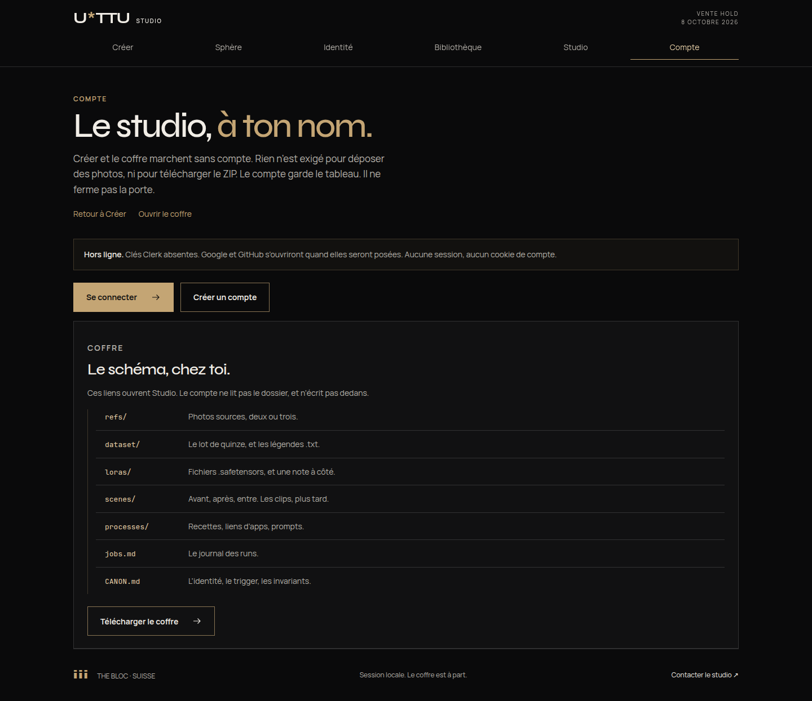
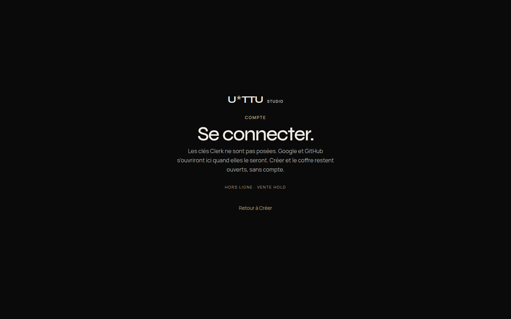
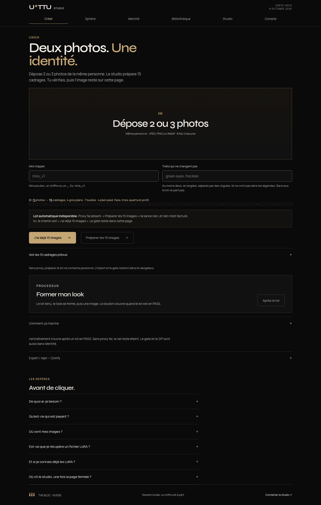
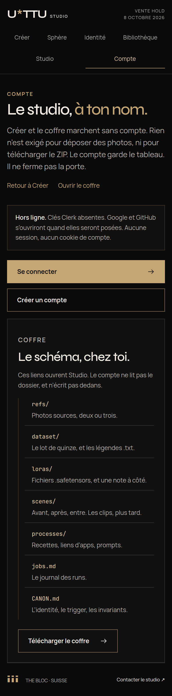

# Compte — Clerk sur Vercel

Le studio s’ouvre sur Créer. Le compte est un mode, en fin de nav. Il ne bloque pas le dépôt, ni le coffre.

L’application Clerk existe déjà. JD est dessus, guide **Next.js → Agent setup**, instance **Development**.

| | |
| --- | --- |
| Id | `app_3JxoXh0l1EQ` |
| Dashboard | https://dashboard.clerk.com/apps/app_3JxoXh0l1EQ |
| Instance ouverte | **Development** (`pk_test_` / `sk_test_`) |
| Production | Pas encore. Autre instance du même app, plus tard (`pk_live_` / `sk_live_`) |

Le CLI de cette livraison n’était pas connecté (`clerk whoami` → `auth_required`). `npx clerk@latest init --framework next --app app_3JxoXh0l1EQ -y --no-skills` ouvre un navigateur et attend un login. Il n’a pas été mené à terme. Sans login, le CLI aurait créé une application keyless, pas celle-ci. Le scaffold Next officiel est déjà dans le dépôt, posé à la main : `src/proxy.ts` (`clerkMiddleware`, fichier proxy de Next 16), `ClerkProvider`, `/sign-in`, `/sign-up`. Le mode keyless reste éteint. Aucune clé n’est dans git.

Cible d’hébergement : **Vercel**. GitHub Pages ne peut plus publier ce dépôt : le proxy Clerk (`src/proxy.ts`) exige un runtime serveur, et l’export statique le refuse. Le workflow `.github/workflows/pages.yml` lance les tests et le build. Il ne déploie plus. L’URL `https://enudimmud.github.io/U-TTU-Studio/` reste la dernière livraison Pages (catalogue processus), figée.

Sans les deux clés, `npm test`, `npm run typecheck` et `npm run build` passent. Compte affiche un placeholder. Aucun cookie de session. Le mode keyless de Clerk est éteint dans `next.config.mjs`, pour ne pas créer une application temporaire tout seul.

## Ce que le code fait déjà

- `src/proxy.ts` — `clerkMiddleware` seulement si les deux clés sont présentes. Aucune route n’est protégée. Créer reste anonyme.
- `src/app/layout.tsx` — `ClerkProvider` seulement si la clé publique est posée. Localisation `frFR`. Apparence sombre.
- `/sign-in` et `/sign-up` — flux OAuth Clerk standard. Google et GitHub apparaissent quand ils sont activés dans le dashboard Clerk. Le code ne parle pas à Google ni à GitHub directement.
- `#compte` — anonyme : « Se connecter », « Créer un compte », rappel que Créer et le ZIP marchent sans compte, et le budget qui attend la session. Connecté : profil, `UserButton`, « Tes runs » sans run cloud, « Ton studio cloud » vide, journal local (libellé, estimation, date) dans `localStorage` sous l’identifiant Clerk, extrait `jobs-extrait.md` à copier ou télécharger, liens vers `refs/`, `dataset/`, `loras/`, `scenes/`, `processes/`, `jobs.md`, `CANON.md`, et le ZIP `public/vault/U-TTU-Studio.zip`. Le compte n’écrit pas dans le coffre.
- Après connexion, retour vers `/#compte`. Après déconnexion, retour vers `/#creer`.

Pas de Stripe. Pas de jobs cloud. Pas de sync du coffre.

## Development et Production

Le sélecteur en haut à droite du dashboard doit rester sur **Development** pour le travail local et les previews. C’est l’instance du 28 septembre 2026.

| | Development | Production |
| --- | --- | --- |
| Quand | Maintenant. Local, et Preview Vercel. | Plus tard, quand le domaine public est décidé. |
| Clés | `pk_test_…` / `sk_test_…` | `pk_live_…` / `sk_live_…` |
| Tirage | `npx clerk@latest env pull --app app_3JxoXh0l1EQ` | `npx clerk@latest env pull --app app_3JxoXh0l1EQ --instance prod` |
| Où les poser | `.env.local`, et Vercel **Preview** (et Development) | Vercel **Production** seulement |
| Google et GitHub | À activer sur cette instance | À réactiver sur l’instance Production. Les clients OAuth ne se copient pas tout seuls. |

Ne pas coller les clés Development dans l’environnement Production de Vercel. Ne pas committer ni l’un ni l’autre.

## Lier l’app et tirer les clés

Sur la machine de JD, déjà connectée au dashboard. Pas dans CI.

```bash
npx clerk@latest auth login
npx clerk@latest link --app app_3JxoXh0l1EQ
npx clerk@latest env pull --app app_3JxoXh0l1EQ
```

`env pull` écrit `.env.local` (clés Development). Le fichier est ignoré par git. Vérifier qu’il n’entre pas dans un commit.

Équivalent, une fois le login fait : `npx clerk@latest init --framework next --app app_3JxoXh0l1EQ --pm npm -y --no-skills`. Le dépôt a déjà le provider, le proxy et les pages. Ne pas laisser cette commande écraser le mode Compte ni remettre un export statique.

Sans ces clés, `npm run dev` reste le placeholder.

## Google et GitHub

Dans l’app `app_3JxoXh0l1EQ`, instance **Development** :

1. Ouvrir https://dashboard.clerk.com/apps/app_3JxoXh0l1EQ
2. Laisser le sélecteur sur **Development**.
3. **Configure → SSO connections** (l’écran peut encore dire Social connections).
4. Activer **Google**. Suivre l’assistant Clerk. S’il demande un client OAuth Google, le créer là. Ne pas coller ce secret dans le dépôt.
5. Activer **GitHub**. Même geste.
6. Ne pas activer TikTok, Instagram, ni X.
7. **Paths**, si l’écran les montre : sign-in `/sign-in`, sign-up `/sign-up`. Le code et `.env.example` les posent déjà.
8. **Domains** de cette instance : `http://localhost:3000`, puis le domaine de preview Vercel quand il existe.

Le composant `SignIn` affiche les providers allumés dans le dashboard. Le code ne parle pas à Google ni à GitHub.

Quand l’instance **Production** sera créée, refaire les étapes 4, 5 et 8 sur cette instance, avec le domaine public.

## Checklist Vercel

1. [Importer le dépôt](https://vercel.com/new) `eNudimmud/U-TTU-Studio`. Framework : Next.js. Racine : `/`.
2. Installation : `npm ci`. Build : `npm run build`. Node 22 ou plus.
3. Ne pas définir `GITHUB_PAGES`. Ne pas définir `NEXT_PUBLIC_BASE_PATH`.
4. Variables. Preview (et Development) : clés **Development**. Production Vercel : clés **Production**, seulement une fois l’instance créée. Sinon, laisser Production vide plutôt que d’y mettre `pk_test_`.

| Variable | Valeur |
| --- | --- |
| `NEXT_PUBLIC_CLERK_PUBLISHABLE_KEY` | `pk_test_…` en Preview. `pk_live_…` en Production. |
| `CLERK_SECRET_KEY` | `sk_test_…` en Preview. `sk_live_…` en Production. |
| `NEXT_PUBLIC_CLERK_SIGN_IN_URL` | `/sign-in` |
| `NEXT_PUBLIC_CLERK_SIGN_UP_URL` | `/sign-up` |
| `NEXT_PUBLIC_CLERK_SIGN_IN_FALLBACK_REDIRECT_URL` | `/#compte` |
| `NEXT_PUBLIC_CLERK_SIGN_UP_FALLBACK_REDIRECT_URL` | `/#compte` |
| `NEXT_PUBLIC_SITE_URL` | URL HTTPS publique, une fois le domaine connu |

5. Déployer une preview. Ouvrir `/` : Créer, sans mur. `/#compte` : boutons. `/sign-in` : Google et GitHub, si l’étape SSO est faite et si le domaine de preview est autorisé sur l’instance Development.
6. Dans Clerk, ajouter ce domaine (`*.vercel.app`, puis le domaine custom) aux domaines de la bonne instance. Sans ça, l’OAuth revient en erreur.

Les noms vides sont dans [`.env.example`](../.env.example). Les valeurs ne vont pas dans git.

## Vérifier

- Anonyme : `#creer` s’ouvre, le dépôt n’exige pas de session, le ZIP du coffre se télécharge depuis Studio et depuis Compte.
- Connecté : `#compte` montre le nom, le bouton de compte, deux listes vides (aucun run cloud, aucun fichier serveur), le journal local de ce compte, les sept liens du schéma. L’extrait markdown reste dans le navigateur.
- Déconnexion : retour à Créer.
- `npm test` et `npm run typecheck` sans aucune clé.

## Captures sans clés

Le 28 septembre 2026, aucune clé Clerk n’est dans ce dépôt. La session connectée (profil, `UserButton`, listes vides) est dans le code. Elle ne s’affiche qu’avec une session. Ici : l’anonyme sur Compte, et la page `/sign-in` en placeholder.

Le journal signé (vide, puis une ligne) est dans [DECISIONS.md](DECISIONS.md). Sans clés, ces cadres passent par un identifiant local qui n’est pas livré. Ici, l’anonyme.





Créer reste la première vue. Compte est en fin de nav.



Sur un écran étroit, les six modes passent à la ligne. Compte reste le dernier. Créer reste la première vue.


