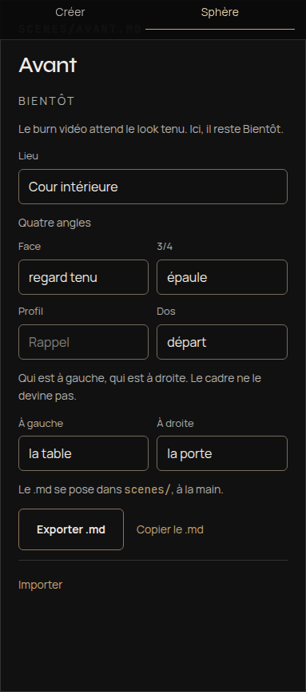
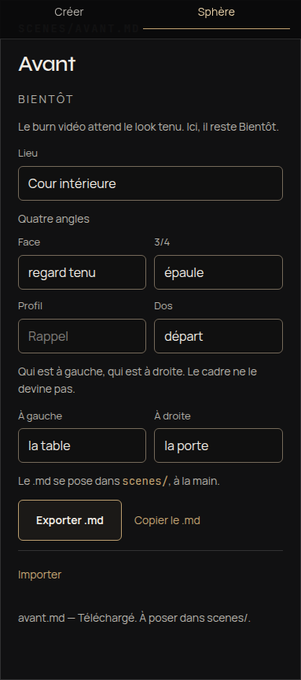
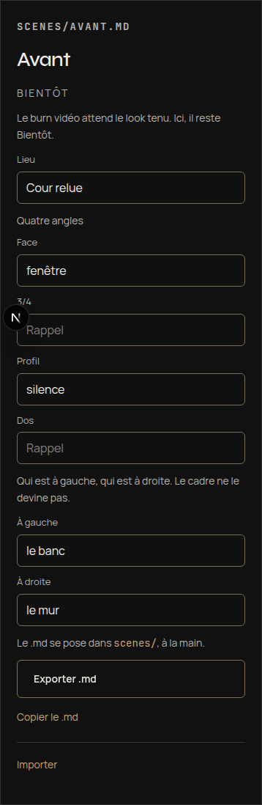
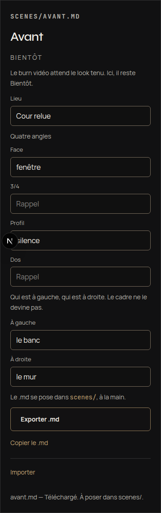
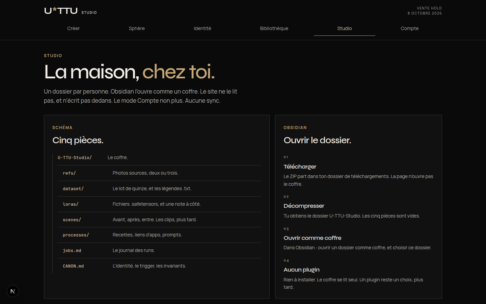
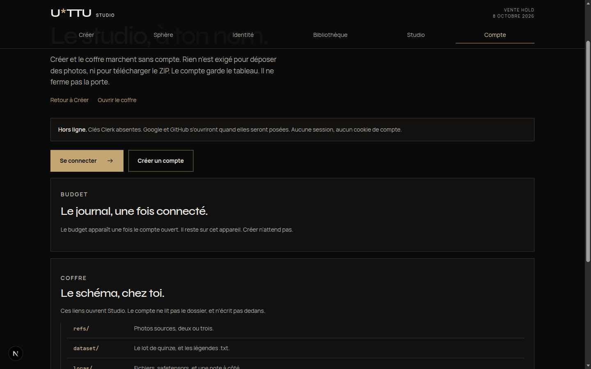
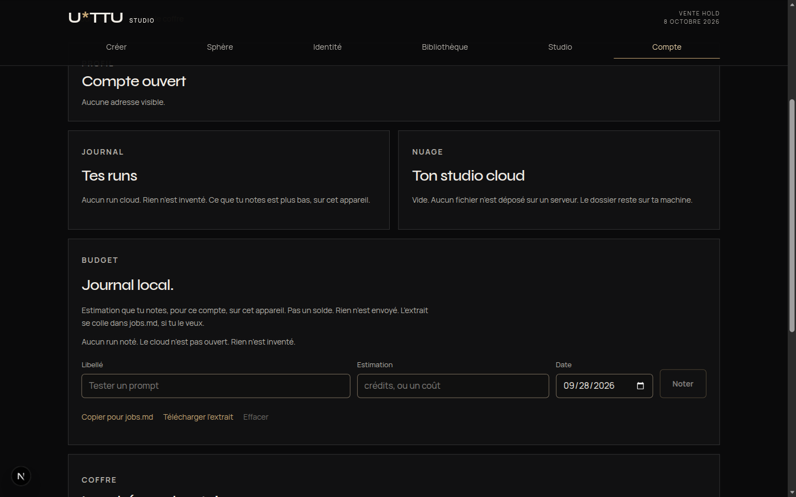
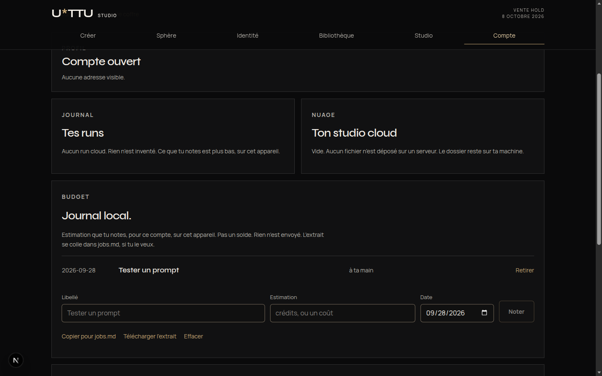
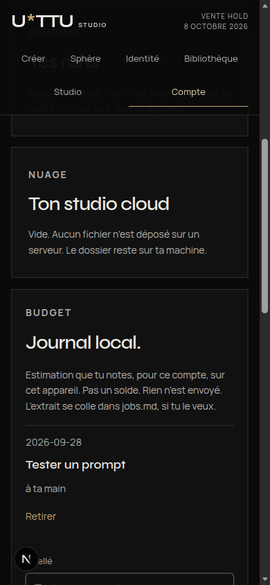

# Registre — C micro

Registre de vérité U*TTU : chaque ligne est un **fait**, une **hypothèse**, une **proposition** ou une **décision**. Dernière mise à jour : 2026-10-07.

## Quatre langues — 7 octobre 2026

- **Décision :** le français reste la source. Anglais, allemand et espagnol suivent le lexique. Le visiteur choisit Français, English, Deutsch ou Español dans la barre du téléphone et dans le rail du bureau. Le choix reste sur l’appareil (`localStorage` et cookie `u-ttu-locale`). L’adresse ne change pas : `/studio`, `#look`, `#prise`, `#personnage`.
- **Décision :** les phrases que les bibliothèques rendent encore en français sont traduites à l’affichage. Les montants restent en francs suisses. Les noms de fichiers, U*TTU, MOC, fal, Comfy, Pièce, Quai et Rue ne sont pas traduits.
- **Fait :** l’allemand et l’espagnol portent `_status: needs_human_audit`. L’anglais porte `reviewed_calques`. Les calques du lexique sont ceux proposés, pas un audit humain. Aucun crédit n’est dépensé.
- **Hypothèse :** un préfixe d’adresse par langue (`/en/studio`) n’est pas retenu.

## Une section, un dossier — 7 octobre 2026

- **Décision JD :** une section de Mon studio est un dossier de contenu. `Prises/` ne tient que les prises tournées. Un gabarit n’est pas une prise.
- **Décision :** les gabarits sous `Templates/` s’appellent `modele-personnage.md`, `modele-scene.md`, `modele-prise.md`. L’arbre affiche « Modèle · Personnage », « Modèle · Scène », « Modèle · Prise ». Il n’affiche jamais le stem nu `prise`.
- **Décision :** la même règle vaut pour tout fichier dont le nom est celui d’une section. Les fiches `Moteurs/personnage.md`, `references.md` et `lieu.md` deviennent `moteur-personnage.md`, `moteur-references.md` et `moteur-lieu.md`. L’arbre les affiche « Moteur · Personnage », « Moteur · Références », « Moteur · Lieu ».
- **Décision :** à l’ouverture, un projet déjà écrit est renommé quand le nouveau fichier est absent. Le texte reste. Une prise sous `Prises/` n’est pas déplacée. Un fichier déjà au nouveau chemin n’est pas écrasé.
- **Fait :** aucun crédit n’est dépensé. Obsidian lit le nom de fichier (`modele-prise.md`). L’arbre de l’app dit « Modèle · Prise ».

## Studio par projet — 7 octobre 2026

- **Décision JD :** un projet est un univers de travail complet. Plusieurs projets vivent sous `Projets/`. La carte racine les liste. La chaîne Personnage → Scène → Prise et la feuille Mon studio ne lisent que le projet en cours.
- **Décision :** créer un projet écrit le squelette (bible, style, lexique, journal, `_MOC.md`, dossiers vides tenus par une fiche). Un ancien dossier (`CANON.md`, `scenes/`, `prises/`, `loras/`) rejoint un projet à la lecture. Un fichier déjà là reste.
- **Décision :** les fiches portent `type`, `projet`, `statut`, et, quand le geste existe, `moteur` et `gesture`. Les moteurs sont des fiches. Aucun graphe n’est écrit. Aucun crédit n’est dépensé.
- **Fait :** l’interface dit « Mon studio », « Exporter mon studio », « Importer un studio ». Elle ne dit pas « Coffre » ni « Vault ».

## Lexique français — 7 octobre 2026

- **Décision JD :** l’interface française suit le lexique. La feuille photos dit **Références** (« Photos des références », « Remettre ces références »). Les aria disent **Lieux**. L’étape de la chaîne dit **Personnage**. Le moteur qui recharge le fichier dit **Personnage (fichier)**. Le chemin dit **Fichier**. Sphère garde son nom et ajoute « Tes prises ».
- **Décision :** six verbes restent distincts. Relier lie un compte. Lancer ouvre une fiche. Tourner lance la prise. Former apprend un fichier. Filmer rend le trajet. Bâtir produit l’image d’un lieu.
- **Décision :** le contrôle s’appelle Moteur. L’étagère dit Distribution. La vidéo dit Prise. L’espace local reste **Mon studio**. La ligne du lexique « FR Coffre · EN Vault » est dépassée : ni Coffre ni Vault ne s’affichent.
- **Fait :** `#look` et le type `look` restent pour les liens déjà posés. La fiche « Prise · Personnage » garde son nom, son payeur rendu et son moteur comfy. Le bouton « Personnage (fichier) » est l’autre geste, sur le compte fal. Aucun switcher EN/DE/ES. Aucun crédit n’est dépensé.
- **Hypothèse :** EN, DE et ES (My studio, Mein Studio, Mi estudio, et le reste du glossaire) attendent un audit humain. Pas de `next-intl` dans cette livraison.

## Mon studio — 7 octobre 2026

- **Décision JD :** l’espace Obsidian local ne s’affiche plus sous le nom « Coffre », ni « Vault ». Le nom produit est **Mon studio**. Le bouton du rail et de la barre dit « Mon studio ». L’export dit « Exporter mon studio (.zip) ». L’import dit « Importer un studio (.zip) ». Les textes d’aide disent « mon studio ».
- **Décision :** plus tard, les autres langues diront My studio, Mein Studio, Mi estudio. Cette livraison ne traduit pas l’app.
- **Fait :** les chemins de code `coffre/` et les identifiants internes restent. Aucun graphe n’est ajouté. Aucun crédit n’est dépensé.

## Deux peaux — 7 octobre 2026

- **Demande JD :** une peau téléphone et une peau bureau, le même coffre. Pas de dépense Comfy. Le bureau n’est pas la colonne du téléphone élargie.
- **Décision :** sous 720 px, la poche validée reste. Les feuilles s’ouvrent par le bas, coins arrondis, sans couvrir tout l’écran. La chaîne Personnage → Scène → Prise reste en bas, au pouce. Le coffre et le solde restent dans la barre du haut. Pas de rail, pas d’étagère, pas de défilement horizontal.
- **Décision :** de 720 à 1079 px, la colonne passe à 720 px. La chaîne reste en bas. La feuille devient une carte centrée. Le rail n’apparaît pas.
- **Décision :** à partir de 1080 px, le plateau a trois zones qui partagent le même état. Le rail de 232 px tient la chaîne et le coffre. L’étagère de 300 px, à droite, montre en même temps la distribution, les lieux et les prises. Le travail est au centre. La feuille s’ouvre en panneau dans cette zone. Le solde reste dans la barre du haut.
- **Fait :** les payeurs des fiches ne changent pas. Aucun graphe Comfy n’est ajouté. `SaveLoRA` reste absent.

## Coffre, carte Obsidian — 7 octobre 2026

- **Demande JD :** le coffre doit se lire comme un second cerveau Obsidian, sans sync serveur. Un seul PR, la première tranche du brief futur.
- **Décision :** l’app tient `MOC.md` à jour, avec des wikilinks vers le look, les personnages, les lieux, les prises et `jobs.md`. L’export ZIP l’inclut. L’import d’un ZIP fusionne les fichiers dans le coffre de l’appareil : une prise ou un personnage déjà là n’est pas effacé, une fiche illisible ne remplace pas une fiche valide. La feuille Coffre dit d’exporter, d’ouvrir le dossier dans Obsidian, puis d’importer. Aucune copie sur le serveur. Détail : [VAULT.md](VAULT.md).
- **Fait :** `SaveLoRA` reste absent du catalogue Cloud. Cette livraison ne forme rien et n’invente pas de nœud.
- **Hypothèse, hors de cette livraison :** Syncthing, iCloud ou un Git privé pourraient porter le dossier entre appareils. L’app ne le fait pas.

## Trajet, personnage dans le plan, liaison, LoRA de lieu — 4 octobre 2026

- **Demande JD :** la liaison depuis le studio pour dépenser les crédits rate environ une fois sur deux. Le correctif n’est pas de déplacer la liaison hors du studio, ni de raccourcir le chemin. Le personnage doit être dans le plan filmé du lieu qui reste, et la caméra doit parcourir ce lieu. Un LoRA de lieu s’apprend sur plusieurs vues de ce lieu, puis sert à en bâtir une image. Le lieu reste au coffre. Les faits et le prix précèdent tout geste payant. Pas de formation réelle, pas de job fal, Farpy ou Comfy. Ne pas brancher l’entraîneur Flux dormant sur le graphe H3.
- **Fait, liaison :** trois courses se croisent. La feuille s’ouvre sous le doigt qui vient de taper « Relier », et ce même tap la referme. La lecture de la session Comfy ouvre `firebaseLocalStorageDb` sans version : si la base n’existe pas encore, cette ouverture en crée une vide, et le script média la supprime ; l’iframe de connexion écrit dans le même temps, donc la session disparaît environ une fois sur deux. Une lecture de solde partie avant une nouvelle clé peut finir après et déclarer le compte délié. Les trois comptes du studio (fal, Comfy, Farpy) passent par la même feuille. Farpy n’a pas de course réseau : sa clé est locale, et c’est la feuille qui la faisait rater.
- **Décision, liaison :** la feuille ignore un tap sur le fond pendant 500 ms après son ouverture. La lecture de la session ne crée plus la base et ne la supprime plus ; seul « Délier » la supprime. Chaque liaison incrémente un compteur : une lecture plus ancienne ne peut plus délier la clé qui vient d’être collée. Les feuilles restent dans le studio. Les clés restent sur l’appareil, jamais dans le coffre.
- **Décision, trajet :** la caméra a un départ et une arrivée, cinq images, interpolation linéaire, images 1 et 5. Le `.blend` Blender 4.1.1 porte les deux poses. Rouvrir le lieu retrouve le trajet. Le déplacer oublie les images du trajet précédent.
- **Décision, personnage dans le plan :** Blender rend le lieu vide. Le LoRA du coffre est la personne, et il n’entre que dans le plan envoyé à `minimax/h3/reference-to-video/lora`, avec ces images comme références du lieu. Un seul geste montre les deux prix (Farpy, puis fal). Si le trajet est déjà rendu, le geste suivant ne quote que fal. Rien ne part sans ce geste. Un volume du `.blend` n’est pas appelé le personnage.
- **Fait, entraîneur de lieu :** `minimax/h3/ref2va/trainer` refuse une archive d’images seules. Il ne peut pas apprendre un lieu à partir de photos. L’entraîneur qui prend déjà des images est `fal-ai/flux-lora-fast-training`, en style (`is_style: true`, `create_masks: false`). Le rechargement est `fal-ai/flux-lora`, une image neuve du lieu. Ce fichier n’entre pas dans le graphe H3 de La prise. Ce n’est pas un maillage : le 3D du lieu reste le fichier Blender.
- **Décision, prix du lieu :** le devis vient du prix unitaire lu sur le compte. Unité inconnue : pas de devis, bouton éteint. Quatre vues au moins, seize au plus. Le bouton plein de la scène reste « Filmer ce plan ». « Former ce lieu » est un lien, et le débit est dans sa feuille.
- **Fait, cette livraison :** Blender 4.1.1 a ouvert le fichier et lu deux poses différentes, plus le milieu du trajet. Aucun job Farpy, fal ou Comfy. Aucun LoRA formé. 0 $.
- **Ce qui quitte encore l’app :** une clé Farpy `farpy_agent_` et du crédit pour le lieu vide ; une clé fal Admin et du crédit pour le personnage dans le plan, et, à part, pour former le lieu. Tant qu’ils manquent, le studio ne prétend pas avoir filmé ni formé.

## Lieux qui restent, Blender, personnage — 4 octobre 2026

- **Demande JD :** une app complète. Un lieu nommé reste : le rouvrir montre le même endroit, et on peut en tenir plusieurs. Depuis ce lieu, on place et on déplace une caméra. La préviz est un rendu Blender de cette caméra dans ce lieu, pas un volume passé à Comfy, pas une image dessinée ici. La prise reçoit cette image et le personnage formé dans le studio, le fichier du coffre. La création reste dans le cloud. Français, téléphone inchangé, écran large inchangé, une action principale, rien sans un geste, pas de run payant pendant la construction.
- **Plancher, Higgsfield Cinema Studio :** un plateau 3D qu’on ré-entre, une caméra (boîtier, focale, ouverture, mouvements), des éléments réutilisables (personnage, lieu, accessoire) et une cohérence de personnage (Soul Cast), une image héro puis le plan filmé, le tout sur leur compte et leurs crédits. Ce n’est pas le dessin de cette app, ni leur interface, ni leur marque, ni leur compte.
- **Décision, lieu :** le lieu est la fiche du coffre. Le plan (pièce, quai, rue) et la caméra (position, visée, focale 24 / 35 / 50 / 85) y sont écrits. Rouvrir la fiche retrouve le même lieu. Plusieurs lieux restent. Changer le plan ne jette pas la caméra. La déplacer oublie l’image précédente, qui montrait une autre caméra.
- **Décision, Blender :** Comfy Cloud n’a pas Blender. Le fichier est un `.blend` Blender 4.1.1, non compressé, écrit par ce binaire, avec les volumes, la caméra, Cycles, 768×1024, une image PNG. Le studio en remplace les transformations. Farpy (`https://farpy.com`) exécute ce fichier : `POST /node/v1/uploads/inspect` lit un devis et ne débite pas ; `POST /node/v1/uploads/{id}/start` avec `quote_id` et `FARPY_LEGAL_V1` est le seul envoi payant. La clé est une clé de job `farpy_agent_`, stockée sur l’appareil (`u-ttu-blender`), jamais dans le coffre. L’image n’apparaît que si le ZIP du job contient un PNG.
- **Décision, prix :** pas de prix de liste collé à la place du devis. Sans devis lisible, le bouton de débit est éteint. La feuille montre le montant renvoyé, en francs suisses. Sans clé, le bouton dit « Relier Blender » et rien n’est dessiné.
- **Décision, prise :** « Personnage » recharge le `.safetensors` du coffre. Si le lieu a une image filmée, elle part avec, et l’absence de photo de look ne bloque plus. Le rail Flux reste dormant. Les références Comfy restent l’autre moteur.
- **Fait, cette livraison :** Blender 4.1.1 a ouvert le fichier écrit par l’app et en a rendu une image Cycles, sur cette machine, pour prouver le fichier. Aucun job Farpy n’a été lancé. Aucun LoRA n’a été formé. 0 $.
- **Ce qui quitte encore l’app :** un compte Farpy, du crédit, et une clé de job `farpy_agent_`. Tant qu’ils manquent, le studio ne prétend pas avoir rendu l’image de l’adhérent.

## Personnage, préviz, remise à zéro, écran large — 4 octobre 2026

La préviz de cette section (GLB, `RenderMesh`) est dépassée par la section ci-dessus. Le personnage, la remise à zéro et l’écran large tiennent.

- **Demande JD :** « Former ton double » n’a rien à faire sur Look. Le LoRA sert la cohérence des personnages créés : un lieu pour en former un, et pour le recharger afin que les prises suivantes tiennent ce personnage. La préviz Blender puis Comfy doit exister, sans Blender sur l’appareil. Chaque page de création se remet à zéro sans effacer le coffre. Un écran large a sa propre mise en page. Le téléphone reste premier.
- **Décision, personnage :** le fil du bas est Look, Rôle, Scène, Prise. Rôle ouvre `#lora`. Look n’a plus de lien vers la formation. Même entraîneur qu’avant, `minimax/h3/ref2va/trainer`. Le brouillon a un nom et deux à quatre photos de ce personnage ; elles accompagnent les clips. Le fichier revient au coffre. La prise « Personnage » le recharge via `minimax/h3/reference-to-video/lora`. Le rail Flux reste dormant.
- **Fait, préviz :** Comfy Cloud n’a pas Blender (`bpy` absent, aucun nœud Blender). Les nœuds « blend » du catalogue mélangent des vidéos. Le studio n’ouvre pas un `.blend` et ne peint pas une image. Ce qui est réel : le studio écrit un GLB de volumes (pièce, quai ou rue) et le tient au coffre. Le graphe envoyé est `Load3DAdvanced` (le fichier seul, viewport vide) → `Get3DComponents` → `CreateCameraInfo` → `RenderMesh` (`solid`) → `SaveImage`. L’image n’apparaît que si ce job en enregistre une. La prise la charge après les photos du lieu.
- **Décision, prix de la préviz :** pas de devis inventé. Le bouton s’éteint si le solde de rendu est illisible ou vide. La confirmation dit que le montant n’est pas connu d’avance. Rien ne part sans elle.
- **Décision, zéro :** « Remettre ce look à zéro », « Remettre ce personnage à zéro » (nom, photos, clips), « Remettre ce lieu à zéro », « Remettre ce plan à zéro ». Les fichiers formés, les autres lieux et les prises déjà tournées restent. « Retirer » reste l’effacement d’une pièce finie.
- **Décision, écran :** sous 1080 px, la colonne téléphone (560 px, fil en bas) ne change pas. À partir de 1080 px, le fil est un rail à gauche et la page se partage : le travail prend la largeur, l’action reste une colonne étroite.

## Délier un compte depuis la feuille ouverte — 3 octobre 2026, nuit

- **Demande JD :** une fois Comfy et fal reliés, aucun des deux ne se délie. Les boutons existent, dans des feuilles que le compteur du haut n’ouvre plus.
- **Fait :** après une liaison, ce bouton ouvre « Comptes ». « Délier ce compte » restait dans les feuilles de liaison, visibles seulement tant que le compte ne l’était pas.
- **Décision :** « Comptes » porte un bouton par compte relié, « Délier le compte de rendu » et « Délier le compte fal ». Chacun retire la clé ou la session de cet appareil. Le coffre, le fichier formé et le compte chez le fournisseur restent.

## Former son double, le recharger dans La prise — 3 octobre 2026, nuit

- **Demande JD :** le constat « pas de chemin » ne suffit pas. Dans l’app, l’adhérent forme son propre LoRA, le fichier arrive dans son coffre, et une création ultérieure charge ces poids. Page dédiée, guide et prix avant tout geste payant. Pas de fichier factice. Pas de run payant par la livraison.
- **Fait, inchangé :** Comfy Cloud ne garde pas un LoRA formé (`SaveLoRA` absent) et ne recharge pas un fichier personnel hors import Hugging Face ou Civitai. Un LoRA Flux ne se branche pas sur H3.
- **Décision :** le compte qui forme et qui recharge est le compte fal de l’adhérent. Entraîneur `minimax/h3/ref2va/trainer` (LoRA H3 référence-vers-vidéo). Création qui charge le fichier : `minimax/h3/reference-to-video/lora`, `loras[].path` = l’adresse du `.safetensors` envoyé depuis le coffre. Même famille que La prise. Le navigateur appelle fal directement (CORS vérifié, 0 $).
- **Décision, page :** `#lora`, hors de la chaîne Look / Scène / Prise. Avant le geste : ce que les clips doivent être (vidéo, 10 à 30, 3 à 30 s), ce que les photos du look font (références, pas le cours), ce que le fichier fera et ne fera pas dans La prise, et le prix du jour. U*TTU en une phrase, en haut de page. Confirmation « Former · débit sur mon compte fal ».
- **Décision, porte :** « Former » et « Tourner » s’éteignent si le solde fal est illisible, vide, si le prix est illisible, ou si le solde est sous le devis. Le devis vient du prix unitaire du compte. Le débit écrit au coffre vient de la facture de la demande, sinon du mouvement de solde.
- **Décision, clé :** une clé fal de portée Admin, créée une fois sur fal.ai, collée dans la feuille. Elle reste sur l’appareil. Elle n’entre pas dans le coffre ni dans l’export. Le compteur du haut montre ce compte quand on forme ou quand La prise est sur « Ton double », et le compte Comfy le reste du temps.
- **Fait :** 0 $ dépensé par cette livraison. Les tests parlent à un faux fal. La première formation d’un vrai compte sera le premier vrai débit.
- **Ce qui quitte encore l’app, une fois :** créer le compte fal, le recharger, et créer la clé Admin.

## Former son LoRA pour la prise — pas de chemin sur Comfy — 3 octobre 2026, soir

Dépassé pour le produit par la section ci-dessus. Le constat Comfy, lui, tient.

- **Demande JD :** dans l’app, l’adhérent forme un vrai LoRA à partir de ses photos, le fichier arrive dans son coffre, et La prise le charge au rendu. Formation et prise sur son propre compte Comfy Cloud. Une page dédiée, avec un guide, avant tout geste payant. Si aucun entraîneur ne produit un fichier que la prise peut charger, le dire et s’arrêter.
- **Fait :** aucun chemin n’existe aujourd’hui sur Comfy Cloud. Le seul entraîneur, `TrainLoraNode`, produit un LoRA qui ne vit que dans le run qui l’a formé : aucun nœud du catalogue Cloud ne l’écrit en fichier (`SaveLoRA` absent), donc rien ne peut arriver au coffre. Et une prise suivante ne charge un LoRA que par son nom dans la bibliothèque du compte, où un fichier personnel n’entre que par un import Hugging Face ou Civitai, plan Creator ou plus. Détail et sources : [COMFY-STACK.md](COMFY-STACK.md#un-lora-formé-par-ladhérent-pour-la-prise--pas-de-chemin-aujourdhui-3-octobre-2026).
- **Fait :** l’hypothèse sur fal est juste. `flux-lora-fast-training` forme un LoRA Flux.1 [dev] ; H3 est un autre modèle, la prise n’en chargerait aucun poids.
- **Correction :** la prise charge aujourd’hui le LoRA turbo 4 pas publié, pour la vitesse. Ce n’est pas le LoRA Character-Swap, qui n’est pas au catalogue Cloud.
- **Décision :** rien n’est construit. Pas de page de formation, pas de bouton qui envoie des photos sans fichier au bout, pas de fichier Flux branché à la prise. Former et tourner dans le même run aurait gardé zéro fichier et repayé l’entraînement à chaque prise, sans preuve que `TrainLoraNode` marche avec H3. Le code fal reste dormant.
- **Proposition, à décider par JD :** demander à Comfy `SaveLoRA` sur Cloud et l’envoi d’un fichier personnel dans la bibliothèque du compte. Avec les deux, la page dédiée se construit telle que demandée.

## Studio direct — tout dans l’app — 3 octobre 2026

- **Décision JD :** le #32 était à moitié fait. Un adhérent, un studio : tenir un look, poser une scène, charger la prise, la lancer, voir le résultat, la publier, sans quitter l’app. Des crédits cohérents. Une mémoire personnelle du studio. Carte blanche sur l’architecture et l’identité, dans le canon U*TTU.
- **Décision, architecture :** l’app est un client local. Elle parle elle-même à l’API documentée de Comfy Cloud (envoi des photos, mise en file, suivi, vidéo), sur le compte de la personne, par le relais même origine déjà en place. Le cadre Comfy n’est plus l’app. La réécriture du template H3 (#31), les apps App Mode et le rail fal quittent l’app.
- **Décision, prise :** MiniMax H3 R2V, graphe construit par le studio (`src/lib/render/take-graph.ts`) : jusqu’à 9 références, 5 ou 8 s, 9:16 / 16:9 / 1:1, rapide 4 pas (LoRA turbo) ou fin 20 pas. **Fait :** les deux variantes passent le `dry_run` de Comfy Cloud, 0 crédit.
- **Décision, compte de rendu :** deux chemins dans une feuille. La connexion Comfy dans la feuille (session sur l’appareil ; la page de Comfy charge ses traceurs, après le geste seulement), ou une clé API (abonnement payant, aucun code tiers). Rien côté serveur.
- **Décision, crédits :** un seul payeur, le compte de rendu. Le solde vient de Comfy. Le coût d’une prise est la différence de deux lectures du solde, avant et après. Sans prise mesurée au même réglage, « non calibré » et aucun chiffre ; ensuite, la plus chère des trois dernières. « Tourner » s’éteint si le solde est illisible, vide, ou sous ce chiffre. Confirmation avant chaque prise. Pas de Stripe. Le studio n’encaisse rien. Le fal n’est plus un rail de l’app : deux payeurs rendraient le compteur faux.
- **Décision, coffre :** le coffre Obsidian reste le pilier, mais l’app l’écrit elle-même : IndexedDB sur l’appareil, rangé comme un dossier Obsidian (`CANON.md`, `refs/`, `scenes/`, `prises/`, `jobs.md`), export ZIP en un geste, dossier Obsidian relié sur ordinateur. Remplace le ZIP de départ à remplir à la main. Pourquoi : [VAULT.md](VAULT.md).
- **Décision, identité :** palette de la fiche personnage, toile en filigrane, fil d’or pour la chaîne, marque `iii`, Soft Error en CRT pour un échec. U*TTU guide en une phrase par moment ; son visage est le portrait canon recadré, pas un nouveau visage. Les planches ne sont pas publiées comme héros ([VISUAL-CANON.md](VISUAL-CANON.md)).
- **Décision, publier :** sur téléphone, la feuille de partage reçoit la vidéo et le texte ; sur ordinateur, enregistrer la vidéo et le brouillon X. Rien n’est publié sans le geste dans X.
- **Décision, compte U*TTU :** `/compte`, facultatif, hors du chemin. Clerk ne se charge que sur `/compte`, `/sign-in`, `/sign-up`. Le journal de budget local est retiré : le coût réel est dans `jobs.md`.
- **Fait :** le relais, ses correctifs médias et le rejeu `/api/view` ne changent pas ; la vidéo d’une prise passe par ce même chemin. Sphère montre les prises du coffre, avec une vignette décodée de chaque vidéo. 0 $ : aucune prise réelle tournée, rien publié.
- **Ce qui quitte encore l’app :** recharger des crédits (chez Comfy), créer une clé API (chemin clé seulement, une fois), joindre la vidéo dans X sur ordinateur. Raisons : [README](../README.md#ce-qui-quitte-encore-lapp).

## Cinéma — l’app : une chaîne, des crédits lisibles, publier — 3 octobre 2026

- **Décision JD :** un adhérent, un studio. Ton style → Ta scène → La prise, en français, une action principale. Sphère est l’étagère. La création tourne dans le cloud. JD ne gère pas de données de visiteurs.
- **Décision :** une seule barre d’app ; la chaîne passe en onglets en bas sur mobile ; Sphère est un outil discret ; le reste est dans « Plus ». Ton style devient une carte de look avec « Poser le monde » comme seul bouton plein. Manifeste web : installable.
- **Décision :** crédits. Pas de processeur de paiement : il n’y en a pas. Le cadre lit le solde Comfy du visiteur et le montre dans « Crédits ». Chaque lancement Comfy passe par « Lancer ce rendu ? » avec estimation et solde ; « Lancer » s’éteint si le solde lu est sous l’estimation basse. Les lancements confirmés et les jobs payés par le studio vont dans un journal local (`u-ttu-usage`), sans identité. Le solde fal du studio n’est pas lu : il faut une clé d’administration fal dans le relais (à créer) ; le bouton reste éteint.
- **Décision :** publier. « Publier la prise » prépare le texte et passe la main à X : feuille de partage de l’appareil avec le fichier, ou brouillon `https://x.com/intent/post`. Rien n’est publié sans le clic dans X. Publier depuis le studio sans quitter la page demanderait une app X (`X_CLIENT_ID`, `X_CLIENT_SECRET`) et que le studio garde le jeton du visiteur : le bouton reste éteint. Aucun connecteur d’autre réseau n’existe ; aucun n’est ajouté.
- **Décision :** Clerk n’est plus monté à la racine. Il ne charge que sur Compte, `/sign-in` et `/sign-up`, télémétrie coupée. Avant : chaque visite de `/studio` chargeait Clerk, `clerk-telemetry.com` et 4 cookies Clerk.
- **Fait :** les tuiles Sphère, le rejeu `/api/view`, l’avertissement Image 01–15 et le brief de La prise (#31) ne changent pas. 0 $ : aucun rendu lancé, rien publié.

## Cinéma — le brief entre dans le cadre, l’écran s’allège — 3 octobre 2026

- **Décision :** Look tenu et monde posé, « Charger la prise ici » prépare le texte du plan et, si les fichiers sont encore là, la photo d’identité et l’image du lieu. L’adresse `?template=video_minimax_h3_r2v` n’accepte pas ces octets : le cadre réécrit le JSON `/templates/video_minimax_h3_r2v.json` après le clic. Le nœud 138 reçoit le texte. Les nœuds 137 et 139 ne changent que si `POST /api/assets` renvoie un nom sûr. Le plein onglet ne reçoit rien de ce brief.
- **Décision :** le run payant n’est pas branché. Pas de `POST /api/prompt`, pas de `run_template`. Le LoRA (nœud 145, interrupteur 146) et l’échange de personnage restent à la main. Seedance n’est pas ce bouton.
- **Décision :** sur `/studio`, le chemin visible est Ton style → Ta scène → La prise. Sphère reste un lien discret. Identité, Bibliothèque, Studio et Compte sont dans « Autres espaces ». Former mon look et Tester un prompt restent, repliés.
- **Fait :** les tuiles Sphère, le rejeu `/api/view`, et l’avertissement Image 01–15 ne changent pas. 0 $ : aucun prompt n’est lancé.

## Cinéma — La prise ouvre le template H3 — 2 octobre 2026, nuit

- **Décision :** Look tenu et monde posé, « Charger la prise ici » ouvre le template officiel `video_minimax_h3_r2v` dans `/comfy-embed`. Le plein onglet reste `https://cloud.comfy.org/?template=video_minimax_h3_r2v`. Un autre id, ou `source=custom`, est refusé.
- **Fait :** le LoRA turbo est le nœud 145, champ `lora_name` (`minimax_h3_ref2v_turbo_4step_v0.1_comfyui_bf16`). L’interrupteur nœud 146 est éteint (4 pas au nœud 144, 20 pas au nœud 143). Le Character-Swap se substitue à ce fichier, à la main. Le look Flux n’y entre pas. Deux images seulement (nœuds 137 et 139).
- **Décision :** le run payant n’est pas branché. Pas de `run_template`, pas de remplissage du brief, pas de burn. Seedance reste un autre chemin. Détail : [CINEMA-STUDIO-BRIEF.md](CINEMA-STUDIO-BRIEF.md).

## Cinéma — Take après le look — 2 octobre 2026, soir

- **Décision JD :** le look tenu peut ensuite nourrir une prise MiniMax H3 en Reference-to-Video, ou un LoRA d’échange de personnage. R2V : modèle `ref2va`, références nommées par balise, LoRA turbo 4 pas. Essai public : [MiniMax-H3-Character-Swap-LoRA](https://x.com/toyxyz3/status/2103933651797045300). Doc : [H3 R2V](https://docs.comfy.org/tutorials/video/minimax/minimax-h3-native#minimax-h3-reference-to-video-r2v).
- **Décision :** ce n’est pas branché. Le bouton de La prise ne lance rien. Pas de route nouvelle, pas de burn. Seedance reste un autre chemin possible. Détail : [CINEMA-STUDIO-BRIEF.md](CINEMA-STUDIO-BRIEF.md).

## Cinéma — tourner dans un monde — shell — 2 octobre 2026

- **Décision JD :** le sommet est de tourner dans un monde virtuel créé. Le shell `/studio` porte Look, Plateau, Take. Plateau reçoit la préviz (images, suites, notes) venue du bureau Blender. Take est le tournage dans ce monde, plus tard via Seedance ou un chemin équivalent, à partir de cette préviz et du look tenu. Pas une boîte texte-vers-vidéo. Le bouton ne lance rien. Détail : [CINEMA-STUDIO-BRIEF.md](CINEMA-STUDIO-BRIEF.md).
- **Fait :** aucun appel Seedance, aucune route fal nouvelle, aucun fichier `.blend` ouvert. Le monde et le plan restent sur l’appareil.

## Cinéma — Look, Plateau, Take — accueil — 2 octobre 2026

- **Décision JD :** l’étoile du nord est Look, puis Plateau, puis Take. L’accueil `/` la montre en français clair. Le shell reste `/studio` et s’ouvre sur Ton style. Détail : [CINEMA-STUDIO-BRIEF.md](CINEMA-STUDIO-BRIEF.md), [LANDING-AND-UX.md](LANDING-AND-UX.md).
- **Décision :** pas de Blender dans le navigateur. La préviz reste un export du bureau. Pas de Night City. Take, plus tard, est Seedance dans le cloud — pas branché. Aucune route fal nouvelle. Aucun burn vidéo.
- **Décision inchangée :** la phase 0 ferme toujours la boucle photo dans Créer. Vente HOLD. Apps Comfy et coffre conservés. Compte sans mur. Les retours Clerk vont vers `/studio#compte` et `/studio#creer`. Un ancien `/#compte` est reconduit vers le shell.

## CORS Worker fal — hôte live — 28 septembre 2026

- **Fait :** l’hôte live du studio est `https://u-ttu-studio.vercel.app`. `ALLOWED_ORIGINS` du Worker accepte cette origine et conserve `https://enudimmud.github.io`.
- **Décision :** le catalogue Pages (`https://enudimmud.github.io/U-TTU-Studio/`) reste figé. `NEXT_PUBLIC_FAL_PROXY_URL` se pose sur Vercel, Production et Preview. Ce n’est plus une variable Actions de Pages. Le Worker n’est pas déployé par cette note. Vente HOLD.

## Pont fiches Sphère — scenes/ — 28 septembre 2026

- **Décision :** chaque fiche Sphère (Avant, Après, Entre) édite le lieu, un rappel pour chacun des quatre angles, et la note gauche / droite. Le texte tient dans `localStorage`, clé `u-ttu-scenes`, sur cet appareil. L’export est un `.md` (`scenes/avant.md`, `scenes/apres.md`, `scenes/entre.md`) que la personne pose dans le dossier. L’import lit un collage ou un fichier, dans le navigateur. Le coffre n’est pas ouvert. Aucune sync.
- **Décision :** le ZIP de départ ne change pas. `scenes/` reste un dossier vide. Le format du `.md` est celui que la personne y dépose.
- **Décision :** Entre ne reçoit pas de partage inventé. Le catalogue ne gagne pas d’adresse Comfy. Cette entrée est le pont que le journal de budget laissait de côté. Le journal ne bouge pas.
- **Décision inchangée :** vente HOLD. Pas de Stripe. Pas de Worker fal. Pas de domaine propre. Créer reste ouvert, sans mur.
- **Fait :** le 28 septembre 2026, dans le navigateur, une fiche Avant se remplit, s’exporte en `avant.md`, refuse le markdown d’une autre fiche, relit un collage et un fichier, et garde le texte après rechargement. Le pointeur est dans Studio. Aucun appel réseau.

## Journal de budget — compte ouvert — 28 septembre 2026

- **Décision :** une fois la session Clerk ouverte, Compte tient un journal local. Une ligne : libellé, estimation (coût ou crédits, texte libre), date. Vingt-quatre lignes au plus. Vide au départ. Pas un solde. Pas de chiffre venu du cloud.
- **Décision :** la persistance est `localStorage`, clé `u-ttu-budget:` plus l’identifiant Clerk. Sans session, le texte d’attente reste. Aucun seau anonyme n’enregistre de ligne. L’ancienne clé globale `u-ttu-budget` n’est pas relue : elle n’appartient pas à un compte.
- **Décision :** l’extrait markdown se copie ou se télécharge (`jobs-extrait.md`). Il reprend le tableau de `jobs.md` (Date, Geste, Dossier, Note). Le dossier reste vide. Le site n’écrit pas dans le coffre.
- **Décision inchangée :** vente HOLD. Pas de Stripe. Pas de sync fal. Entre et le lien Vault↔Sphère ne bougent pas. Créer reste ouvert sans compte.
- **Fait :** sans clés Clerk, la session réelle ne s’ouvre pas. `npm test` couvre l’ajout, la clé par compte, l’extrait et le vide. Les captures signées ci-dessous montent ce panneau avec un identifiant local, le temps d’une vérification. Ce branchement n’est pas dans le code livré. L’anonyme est la page réelle : le texte d’attente, pas de formulaire.

## Entre deux images — partage manquant — 28 septembre 2026

- **Fait :** « Former mon look » reste `?share=798eb224b972` (record `e8d7c649-0cb5-466b-be1a-4d7caa9204c2`, graphe `c-micro-train-image`, 40 nœuds). « Tester un prompt » reste `?share=25954f3b0278` (record `d5746aa7-b780-4e09-b877-0cf39309e875`, graphe `c-micro-prompt-test`, 11 nœuds). Les deux partages se résolvent. Vérifié le 28 septembre 2026.
- **Fait :** aucun partage Entre. L’historique git, les docs et le workspace Comfy (ces deux workflows seulement) n’en portent pas. Aucune adresse n’est inventée. Cette entrée remplace le « Entre reste Bientôt » des livraisons catalogue et doctrine du même jour, pour le processus. Le burn vidéo des fiches ne bouge pas.
- **Décision :** « Entre deux images » quitte « Bientôt » pour « Partage manquant ». Même carte que Former et Tester, bouton éteint, pas de cadre. La fiche Entre dit la même chose et n’ouvre rien. Si `NEXT_PUBLIC_COMFY_ENTRE_APP_URL` est un `https://cloud.comfy.org/?share=` valide, et que ce n’est ni Former ni Tester, la carte passe live et la fiche lance ce cadre, après le second clic déjà en place. Avant et Après restent « Bientôt ».
- **Décision inchangée :** vente HOLD. Pas de Worker fal, pas de Stripe, pas de domaine. Pas de budget, pas de coffre. Créer reste ouvert sans compte.

## Doctrine du burn — fiches Sphère — budget Compte — 28 septembre 2026

- **Décision :** avant un burn cher (long entraînement, vidéo), le canon se montre. Angles du look, mot d’appel, traits constants (yeux, marques), pointeur vers `CANON.md`. Le gate est souple : avertissement, puis confirmation. Les images fixes et Créer anonyme ne sont pas bloqués. « Tester un prompt » est le geste cheap, à côté de Former. La musique n’entre pas dans la génération : elle se pose au montage. Note seulement.
- **Décision :** Sphère porte des fiches Avant, Après, Entre. Chaque fiche a un nom de lieu, le rappel des quatre angles, une note gauche / droite, et le lien `scenes/`. Prolonger tient mieux qu’une régénération isolée. Entre reste Bientôt. Aucune troisième app Comfy.
- **Décision :** Compte, une fois connecté, montre un Budget. Journal local, lignes saisies ici, vide au départ. Pas de solde cloud. Pas de runs inventés. Anonyme : le budget attend le compte, Créer reste ouvert. Sans clés Clerk, le placeholder reste.
- **Décision inchangée :** vente HOLD. Pas de Stripe. Pas de Worker fal. Pas de domaine propre. L’export Pages n’est pas réactivé. Compte reste en fin de nav.

## Fondation compte — Vercel et Clerk — 28 septembre 2026

- **Décision :** Vercel est la cible officielle. L’export statique GitHub Pages est retiré : `src/proxy.ts` (Clerk) ne peut pas vivre dans `output: "export"`. Le workflow [pages.yml](../.github/workflows/pages.yml) ne publie plus. Il vérifie `npm test`, `npm run typecheck` et `npm run build` sans clés. Le site déjà en ligne sur `https://enudimmud.github.io/U-TTU-Studio/` reste la dernière livraison Pages (catalogue processus). Il ne recevra plus cette branche. Détail : [AUTH.md](AUTH.md).
- **Décision :** le compte est un sixième mode, **Compte**, en fin de nav. Identité reste le canon du personnage (`CANON.md`, `loras/`). Compte n’est pas une pièce du coffre, et ne passe pas devant Créer. Anonyme : créer, sphère, ZIP. Connecté : profil, `UserButton`, listes vides « Tes runs » et « Ton studio cloud », liens vers le schéma.
- **Décision :** Clerk, Google et GitHub, flux OAuth standard (`SignIn` / `SignUp`). Les providers s’activent dans le dashboard Clerk, pas dans un second SDK. Pas de Stripe, pas de TikTok, Instagram ou X. Pas de Worker fal. Pas de sync R2 ou Git.
- **Fait :** sans `NEXT_PUBLIC_CLERK_PUBLISHABLE_KEY` et `CLERK_SECRET_KEY`, le build et les tests passent. Le proxy n’appelle pas Clerk. L’UI montre un placeholder. Le mode keyless de Clerk est forcé éteint (`NEXT_PUBLIC_CLERK_KEYLESS_DISABLED`), pour ne pas créer une app temporaire tout seul.
- **Fait :** l’application Clerk existe déjà. Instance **Development**, id `app_3JxoXh0l1EQ` ([dashboard](https://dashboard.clerk.com/apps/app_3JxoXh0l1EQ)). Le CLI de cette livraison n’était pas connecté (`auth_required`). `clerk init --app app_3JxoXh0l1EQ` ouvre un navigateur et attend. Il n’a pas été mené à terme : sans login, le CLI crée une app keyless au lieu de celle-ci. Aucune clé n’a été écrite. Le lien et `clerk env pull` sont pour JD ([AUTH.md](AUTH.md)).
- **Décision :** cette entrée remplace le « pas d’auth » des livraisons shell, coffre et catalogue du même jour. La vente reste HOLD. Les jobs cloud ne sont pas inventés : les listes sont vides.
- **Fait :** le schéma du ZIP ne change pas. `refs/`, `dataset/`, `loras/`, `scenes/`, `processes/`, `jobs.md`, `CANON.md`.

## Catalogue des processus — 28 septembre 2026

- **Décision :** les apps Comfy Cloud sont un catalogue de processus de création, pas une page technique. La source est `src/lib/processes.ts`. Sphère en est la maison. Créer garde le parcours 2–3 photos → lot de 15, et pointe « Former mon look » une fois le lot en PASS.
- **Décision :** l’interim reste l’App Mode en embed, chargé au clic, avec le consentement déjà en place (traceurs de Comfy). « Lancer » ouvre ce cadre dans la page. Pas de nouvel onglet forcé. Une API Comfy dans le domaine du studio, plus tard.
- **Fait :** deux processus sont live. « Former mon look » reprend l’app `?share=798eb224b972` (`e8d7c649-0cb5-466b-be1a-4d7caa9204c2`). « Tester un prompt » reprend `?share=25954f3b0278` (`d5746aa7-b780-4e09-b877-0cf39309e875`). Aucune troisième app n’est créée.
- **Décision :** Avant, Après et Entre deux images restent « Bientôt ». Ces deux apps ne tiennent pas un passage entre deux images. On ne les présente pas comme une scène.
- **Fait :** le panneau Studio liste le catalogue en texte et renvoie au dossier `processes/` et au journal `jobs.md`. Le site n’écrit pas dans le coffre. Le ZIP de départ ne change pas.
- **Décision inchangée :** vente HOLD. Worker fal éteint. Pas d’auth, pas de Stripe.

## Studio maison — coffre Obsidian — 28 septembre 2026

- **Décision :** chaque personne gère son studio dans un vault Obsidian, sur sa machine. Le mode Studio n’est plus un tableau « bientôt ». Il est la maison : schéma, mode d’emploi, ZIP de départ. Le site ne lit pas le coffre et n’écrit pas dedans. Détail : [VAULT.md](VAULT.md).
- **Décision :** le schéma canon est `U-TTU-Studio/` avec `refs/`, `dataset/`, `loras/`, `scenes/`, `processes/`, `jobs.md`, `CANON.md`. Le ZIP ajoute un `README.md` de mode d’emploi, qui n’est pas une pièce de travail. Aucun plugin Obsidian n’est requis.
- **Décision :** correspondance des modes, dans l’ordre du shell. Créer → `refs/` et `dataset/`. Sphère → `scenes/`. Identité → `CANON.md` et `loras/`. Bibliothèque → les dossiers déjà remplis (`refs/`, `dataset/`, `loras/`, `scenes/`). Studio → `jobs.md` et `processes/`.
- **Fait :** le ZIP est produit par `src/lib/vault.ts` et déposé dans `public/vault/U-TTU-Studio.zip`. `npm run build` le régénère avant l’export. GitHub Pages le sert comme les autres fichiers de `public/`. Pas de Worker, pas de compte, pas de sync.
- **Proposition :** avec un compte, plus tard, une sync optionnelle vers R2 ou un Git privé. Le coffre reste utilisable hors ligne sans compte. Hors de cette livraison.
- **Décision inchangée :** vente HOLD. Sphère reste un aperçu sans rendu vidéo. Pas d’auth, pas de Stripe, pas de déploiement fal.

## Shell et DA — avant le Worker — 28 septembre 2026

- **Décision :** le shell Studio OS et la DA de Créer passent avant le déploiement du Worker fal. Cinq modes dans une seule page : Créer, Sphère, Identité, Bibliothèque, Studio. Hash client, export Pages inchangé. Pas de route serveur, pas d’auth, pas de Stripe.
- **Décision :** tant que `NEXT_PUBLIC_FAL_PROXY_URL` est vide, les boutons qui lanceraient fal restent éteints. Les états hors ligne le disent. Aucun appel réseau n’est simulé. Le Worker n’est pas déployé. 0 $.
- **Fait :** Créer garde le parcours 2–3 photos → plan de 15, l’import des 15 images, le gate et le repli Comfy replié. Le tiroir « Comment ça marche » reste secondaire. Sphère (Avant / Après / Entre), la bibliothèque et le tableau sont des panneaux réels : aperçus « bientôt », sans vidéo et sans compte. Identité reprend le gate, les légendes, le ZIP et le rail fal.
- **Décision inchangée :** vente HOLD. Échéance au 8 octobre 2026, visible sans devenir le héros. La Phase 0 ci-dessous avait exclu Sphère et dashboard : cette décision ajoute leurs panneaux, pas leur backend.
- **Fait :** « Préparer les 15 images » ne part que si le trigger est valide, qu’il y a 2 ou 3 photos, et au moins 2 invariants (G02). Le contrôle est dans le client, avant l’appel. Un lot incomplet ne lance rien. Sans proxy, « J’ai déjà 15 images » est le bouton principal. Pas de déploiement Worker, pas de plafond, pas d’appel fal payant.

## Phase 0 — Créer maintenant — 28 septembre 2026

- **Décision de cette livraison :** la page s’ouvre sur Créer. Le tutoriel est un tiroir. Le chemin principal est fal, dans la page. Comfy est un repli replié (« Expert »), chargé seulement après un second clic. La vente reste HOLD. Pas de Stripe, d’auth, de dashboard ni de Sphère vidéo.
- **Fait :** le gate reste 15 JPEG et 15 légendes. Le plan de `src/lib/fal-bootstrap.ts` vise le repère G20 (4 gros plans, 7 bustes, 4 plein pied) et les trois angles de visage. Un test construit un lot avec ce plan, deux invariants et les cinq confirmations : verdict PASS. La revue humaine (garder, confirmations) n’est pas sautée.
- **Fait, endpoint :** variations via `fal-ai/flux-pro/kontext/multi` (`image_urls`, `prompt`, `aspect_ratio` `1:1`, `output_format` `jpeg`, `num_images` 1, `enhance_prompt` false). Schéma lu le 28 septembre 2026 sur la page API fal. Le prompt est fixé côté Worker : le navigateur envoie les photos et le trigger, pas la consigne. Le trigger n’est pas dans le prompt de génération ; il n’entre que dans les légendes.
- **Hypothèse :** cet endpoint, marqué expérimental par fal, garde l’identité à partir de 2 ou 3 photos quand on ne change que le cadrage et la scène. Non mesuré : aucun appel fal dans cette livraison (0 $).
- **Hypothèse de prix :** 0,04 $ par image, tarif publié pour Flux Kontext Pro sur la page tarif fal le 28 septembre 2026 (15 images ≈ 0,60 $). Une ligne de prix distincte pour l’id `/multi` n’a pas été vue. Le taux 1 USD = 0,82 CHF reste non vérifié.
- **Proposition :** si le multi déçoit à la première facture ou au premier lot réel, remplacer l’id par `fal-ai/flux-pro/kontext` et n’envoyer qu’une `image_url` (l’index `refIndex` du plan). Le gate et l’UI ne bougent pas.
- **Fait d’hébergement :** l’export Pages statique reste le build. Le calcul nouveau est dans le Worker (`POST /bootstrap`, `GET /file`). `FAL_KEY` n’est pas dans `NEXT_PUBLIC_*`. Le Worker n’a pas été déployé ici.
- **Décision inchangée :** échéance au 8 octobre 2026 ou 1 CHF. Cette phase ne lève pas le HOLD.

## Reprise après PR #5 — 26 septembre 2026

- **Décision JD (passation)** : C micro uniquement, vente HOLD, Look-Lock KILL ; échéance au 8 octobre 2026 ou 1 CHF payant. Pas de fusion par Astra sans feu JD, PR #4 hors périmètre des modifications.
- **Fait GitHub vérifié le 26 septembre** : PR #5 fusionnée le 25 septembre (`41ef200`), ainsi que PR #4. Les corrections sont reportées sur ce `main`, doctrine UI conservée, pour une PR de suivi DRAFT.
- **Décision de périmètre** : rail fal expérimental en plus du repli Comfy, même gate de 15 JPEG et légendes. Cette décision remplace la restriction historique à Comfy seul ; elle ne change pas le produit.
- **Fait vérifié dans le code** : la clé fal reste côté Worker ou shell smoke. La variable publique `NEXT_PUBLIC_FAL_PROXY_URL` active le panneau après PASS ; vide, elle le garde en « Script seul ».
- **Fait de cette reprise** : aucun déploiement Worker ni appel fal réel (0 $). Les tests utilisent un faux fal ; la recette et les limites sont dans [FAL-SPIKE.md](FAL-SPIKE.md).
- **Preuve rapportée par la passation** : smoke API live PASS sur la machine U*TTU, 100 étapes puis une image à 0,75, dataset synthétique. Non rejoué ici, aucune preuve de qualité identité.
- **À vérifier** : fidélité sur corpus réel, facture fal, taux USD/CHF (actuellement fixe et non vérifié), expiration effective des fichiers, ressources Cloudflare et configuration distante. La commercialisation reste HOLD.

## Décisions

| Décision | Par | Date |
| --- | --- | --- |
| Un projet est l’univers de travail. `Projets/<slug>/` tient bible, personnages, lieux, prises, journal et moteurs. La chaîne ne lit que le projet en cours. L’ancien dossier rejoint un projet sans écraser un fichier déjà là. | JD | 2026-10-07 |
| Lexique FR : feuille photos = Références. Aria = Lieux. Chaîne = Personnage. Moteur fichier = Personnage (fichier). Chemin = Fichier. Sphère + « Tes prises ». Moteur, Distribution, Prise. Mon studio, pas Coffre ni Vault. Pas de switcher de langue. | JD | 2026-10-07 |
| L’espace Obsidian local s’appelle Mon studio. Pas « Coffre », pas « Vault » dans l’interface française. Export : « Exporter mon studio ». Import : « Importer un studio ». EN / DE / ES plus tard : My studio, Mein Studio, Mi estudio. | JD | 2026-10-07 |
| Deux peaux, même coffre. Sous 720 px : poche validée, feuille par le bas, chaîne au pouce, coffre et solde en haut. De 720 à 1079 px : colonne 720 px, chaîne en bas, feuille carte. Dès 1080 px : rail 232 px (chaîne + coffre), étagère 300 px (distribution, lieux, prises ensemble), travail au centre, feuille en panneau, solde en haut. | JD (brief futur, tranche F2) + livraison | 2026-10-07 |
| Coffre second cerveau : `MOC.md` tenu par l’app, wikilinks vers look, personnages, lieux, prises et journal. Export ZIP avec la carte. Import ZIP en fusion, sans effacer une prise ou un personnage déjà là. Pas de sync serveur. | JD (brief futur, tranche F1) + livraison | 2026-10-07 |
| Former son double sur le compte fal de l’adhérent (`minimax/h3/ref2va/trainer`), fichier `.safetensors` au coffre, rechargé par `minimax/h3/reference-to-video/lora`. Page dédiée, devis avant le geste, bouton éteint sans solde lisible. Comfy Cloud ne fait toujours pas ce chemin. Clé Admin fal sur l’appareil seulement. | JD (rejet du constat seul) + livraison | 2026-10-03 |
| Pas de page de formation sur Comfy Cloud : `TrainLoraNode` ne peut pas être enregistré en fichier (`SaveLoRA` absent), et une prise ne charge que les LoRA de la bibliothèque du compte. Pas de LoRA Flux branché à H3. Constat tenu ; le produit passe par fal. | JD (demande) + livraison (constat) | 2026-10-03 |
| Studio direct : l’app tourne la prise H3 R2V elle-même sur le compte Comfy Cloud de la personne (API documentée, relais même origine), après confirmation. Un seul payeur, coût mesuré par le solde, « non calibré » avant mesure. Coffre Obsidian écrit par l’app (IndexedDB, export ZIP, dossier relié). U*TTU guide en une phrase. fal, App Mode, template réécrit et journal de budget quittent l’app. Compte à `/compte`. | JD (intention, carte blanche) + livraison | 2026-10-03 |
| App : une barre, la chaîne en onglets mobiles, Sphère étagère, carte de look. Crédits : solde Comfy lu dans le cadre, « Lancer ce rendu ? » avant chaque `POST /api/prompt`, journal local. Publier : feuille de partage ou brouillon X, rien sans clic. Clerk seulement sur Compte et connexion, télémétrie coupée. Solde fal et publication directe : éteints, secrets nommés. | JD (intention) + livraison | 2026-10-03 |
| La prise écrit le texte du plan dans le nœud 138 du cadre H3. Les photos (137, 139) ne partent que si `/api/assets` renvoie un nom. L’URL du template ne porte pas les octets. Plein onglet sans brief. Run payant non branché. Écran : une chaîne, Sphère en retrait. | Livraison | 2026-10-03 |
| La prise, look tenu et monde posé, ouvre `video_minimax_h3_r2v` dans le cadre. LoRA turbo : nœud 145 `lora_name`, interrupteur 146 éteint. Character-Swap à la main dans ce champ. Run payant non branché. Pas de burn. | Livraison | 2026-10-02 |
| Take, après le look tenu : MiniMax H3 R2V (`ref2va`, balises, LoRA turbo 4 pas) ou LoRA d’échange de personnage. Non branché. Pas de burn. Seedance reste possible. | JD | 2026-10-02 |
| Étoile cinéma : Look → Plateau → Take. Accueil `/`, shell `/studio`. Pas de Blender navigateur, pas de Night City, pas de route Seedance ni fal vidéo. Phase 0 photo inchangée. Vente HOLD. | JD (verrou) + livraison (accueil) | 2026-10-02 |
| L’hôte live est Vercel (`https://u-ttu-studio.vercel.app`). Le Worker fal l’accepte en CORS, avec le catalogue Pages figé. `NEXT_PUBLIC_FAL_PROXY_URL` est une variable Vercel (Production et Preview). Vente HOLD. | Livraison (CORS Worker) | 2026-09-28 |
| Les fiches Sphère s’exportent en `.md` pour `scenes/`, se relisent par collage ou fichier, et restent dans `localStorage`. Le ZIP ne change pas. Aucune sync. Entre sans partage inventé. Vente HOLD. | Livraison (mission pont fiches) | 2026-09-28 |
| Compte signé tient un journal local, clé par identifiant Clerk : libellé, estimation, date. Extrait markdown, sans écriture dans le coffre. Pas de solde, pas de Stripe, pas de sync fal. Anonyme : l’attente. Vente HOLD. | Livraison (mission budget) | 2026-09-28 |
| Entre deux images est au catalogue comme Former et Tester. Sans partage Comfy distinct, l’état est « Partage manquant » : pas de cadre, pas d’adresse inventée. Un `?share=` réel, plus tard, ouvre la fiche. Avant et Après restent Bientôt. Vente HOLD. | Livraison (mission Entre) | 2026-09-28 |
| Le burn cher attend le canon, avec avertissement et confirmation. Les fixes restent ouvertes. Sphère tient les fiches de lieu. Compte note un budget local, vide, sans solde cloud. Entre reste Bientôt. Vente HOLD. | Livraison (mission doctrine) | 2026-09-28 |
| Vercel est la cible. Clerk (Google + GitHub) ouvre le mode Compte, sans mur devant Créer. Sans clés : placeholder, build vert. Pages n’est plus publié. Pas de Stripe, pas de sync, pas de jobs cloud. Vente HOLD. | Livraison (mission compte) | 2026-09-28 |
| Les apps Comfy sont un catalogue de processus. Interim : embed App Mode au clic, avec consentement. API dans le domaine, plus tard. Sphère tient les cartes. Entre deux images reste « Bientôt ». Vente HOLD. | Livraison (mission catalogue) | 2026-09-28 |
| Le mode Studio est la maison du coffre Obsidian : schéma canon, ZIP de départ, hors ligne. Pas de sync, pas de compte. Sphère reste sans vidéo. Vente HOLD. | Livraison (mission vault) | 2026-09-28 |
| Shell à cinq modes et DA Créer avant le Worker fal. Proxy vide : boutons fal éteints, pas de réseau simulé. Sphère, bibliothèque et tableau en panneaux « bientôt ». Vente HOLD. | Livraison (mission shell) | 2026-09-28 |
| Tuer A (Look-Lock, forfait DA et ZIP-juge) : retrait du site, de la nav, des métadonnées et de la carte OG, sans route d’archive. | JD (mission) | 2026-09-24 |
| C micro est l’unique offre : dataset propre → LoRA → 1 image. | JD (mission) | 2026-09-24 |
| Date de kill au 2026-10-08, ou 1 client payant avant. | JD (mission) | 2026-09-24 |
| Une seule stack : Flux.1 [dev] sur Comfy Cloud, pas de SDXL en parallèle. | Livraison ([COMFY-STACK.md](COMFY-STACK.md)) | 2026-09-24 |
| Entraînement et image dans le même run Comfy. | Livraison, imposé par l’absence de `SaveLoRA` sur Cloud | 2026-09-24 |
| Dataset fixé à 15 images exactement. | Livraison, imposé par les emplacements fixes de l’App Mode | 2026-09-24 |
| FAIL réservé aux violations ; information manquante en « À faire » ; PASS exige tout en PASS. | Livraison, après QA | 2026-09-24 |
| Aucun crédit Comfy dépensé pendant la livraison. Premier run = calibration par JD. | Livraison | 2026-09-24 |
| Après PASS, les deux apps Comfy s’affichent dans la page (iframe), avec « Ouvrir en plein onglet » au-dessus de chaque cadre. Pas de proxy, pas de crédits Studio, pas de préremplissage des 15 images. Ne débloque pas la vente. | Livraison | 2026-09-24 |
| Cadres Comfy chargés au clic seulement (« Charger l’app Comfy ici ») : Comfy charge ses propres traceurs, il faut le consentement des visiteurs CH/UE. « Ouvrir en plein onglet » reste disponible sans charger le cadre. | JD | 2026-09-24 |
| Doctrine LoRA 2026 intégrée au guide, sans changer la stack ni le statut de vente : repère de cadrage, coaching des légendes, grille de test. Pas de pile Pony, Kohya ou SDXL, pas d’auto-bootstrap (4 à 8 références → mini-LoRA → régénération). | JD (mission) | 2026-09-24 |
| Répartition visée des 15 images : 20–30 % gros plans, 40–50 % buste, 20–30 % plein pied, soit 3–5 / 6–8 / 3–5. Contrôle G20 en À NOTER, jamais bloquant ; G13 reste le minimum bloquant ([DATASET-GATE.md](DATASET-GATE.md#repère-de-cadrage-g20)). | JD (mission) | 2026-09-24 |
| Coaching des légendes : principe « ce qui change / ce que le trigger tient », exemples FAIL et PASS, aide sur chaque carte. Aucune règle nouvelle. | JD (mission) | 2026-09-24 |
| Grille de test à l’étape 3 : 3 prompts fixes × forces 0,60 / 0,75 / 0,90, seed de l’étape 3. Faute de `SaveLoRA`, ni checkpoint ni LoRA réutilisable : comparaison avec/sans LoRA et variation de force. Une case = un run complet, coût affiché ([COMFY-STACK.md](COMFY-STACK.md#grille-de-test-étape-3)). | JD (mission) | 2026-09-24 |
| Étapes d’entraînement par défaut inchangées (800). 1 200 à reconsidérer après calibration. | JD (mission) | 2026-09-24 |

## Faits

- Le catalogue Comfy Cloud contient `TrainLoraNode`, `MakeTrainingDataset`, `LoraModelLoader`, `LossGraphNode`, `CreateList`, `ImageScaleToTotalPixels` et `Basic data handling: StringSplitlinesDataList`. Il ne contient ni `SaveLoRA` ni les loaders de dataset par dossier (vérifié par MCP le 2026-09-24).
- Runs limités à 30 min en Standard et Creator, 60 min en Pro. GPU à ~0,39 crédit/s. 211 crédits ≈ 1 $. Import de LoRA réservé aux plans Creator et plus, depuis Hugging Face ou Civitai.
- `estimate_credits` renvoie 0 crédit pour les deux workflows : il ignore le temps GPU.
- Les deux workflows passent la validation `submit_workflow` en `dry_run`. Ils sont sauvegardés dans le workspace Comfy (records `e8d7c649…` et `d5746aa7…`, version 2 avec App Mode) et partagés en `?share=798eb224b972` et `?share=25954f3b0278`.
- Les graphes versionnés dans `public/comfy/` correspondent au générateur, lien par lien et valeur par valeur (`tests/comfy.test.ts`).
- QA E2E sur Chrome avec 20 images synthétiques : chaque piège est signalé, le PASS n’arrive qu’avec 15 images propres, le ZIP est valide ([QA.md](QA.md)).
- `cloud.comfy.org` envoie `frame-ancestors 'self' https:`, sans `X-Frame-Options` (2026-09-24). Après le clic, Chrome affiche la connexion Comfy dans les cadres du guide servi en HTTPS ; une page HTTP est refusée ([QA.md](QA.md#cadre-comfy-dans-le-guide)).
- La page de connexion Comfy appelle `www.googleadservices.com` et `px.ads.linkedin.com` (journal réseau Chrome, 2026-09-24). Avant le clic sur « Charger l’app Comfy ici », le guide ne contacte aucun domaine `comfy.org`.
- Frontend Comfy (`useSharedWorkflowUrlLoader.ts`, `workflowService.ts`) : un `?share=` passe par la connexion, puis la fenêtre « Open shared workflow », puis charge le graphe dans la vue donnée par `extra.linearMode`. Les snapshots `798eb224b972` et `25954f3b0278` ont `linearMode: true`.
- Le workflow d’entraînement a un seul prompt (`CLIPTextEncode`) et une seule force (`LoraModelLoader`) : un run rend une seule case de la grille de test, plus son témoin.

## Hypothèses — à mesurer

- Vitesse d’entraînement Flux dev à 0,25 MP sur les GPU Comfy : 0,7 à 1,4 s par étape. Frais fixes de 90 à 240 s. Image 1024² de 9 à 14 s.
- 800 étapes, lr 4e-4 et rank 16 sur 15 images suffisent pour une identité reconnaissable (réglages proches des entraîneurs Flux « rapides » courants). Non vérifié sur Comfy.
- Le `TrainLoraNode` du core entraîne correctement Flux.1 [dev] : implémentation générique, flow-matching géré par `model_sampling`. Node marqué expérimental.
- Les seuils de netteté (100 absolu, 35 % de la médiane) et de couleur (3,5 MAD) détectent assez de problèmes sans trop de faux positifs sur des photos réelles. Calibrés uniquement sur des images synthétiques.
- Un lien `?share=` ouvre l’App Mode une fois connecté. C’est ce que fait le code du frontend Comfy ; l’écran connecté n’a pas été vu.
- La connexion Comfy fonctionne dans le cadre. Sa session vit en localStorage et IndexedDB, partitionnés dans un cadre tiers : une connexion de plus est attendue. Non vérifié sans compte tiers ; repli : « Ouvrir en plein onglet ».
- La répartition 20–30 / 40–50 / 20–30 % et la bande d’usage 0,70–0,85 viennent des pratiques LoRA 2026 pour Flux. Elles ne sont pas calibrées sur ce stack (0,25 MP, 800 étapes, rank 16).
- Chaque run Comfy Cloud réentraîne la LoRA. En local, ComfyUI réutilise la sortie d’un node dont les entrées n’ont pas changé ; rien n’indique que Comfy Cloud le fasse d’un run à l’autre. À vérifier pendant la calibration ([COMFY-STACK.md](COMFY-STACK.md#coût--modèle-et-calibration), étape 5).
- Même dataset, mêmes étapes et seed d’entraînement fixe (42) : d’un run à l’autre, la LoRA ne varie que par les écarts de calcul du GPU. C’est ce qui rend les cases de la grille comparables. Non mesuré.

## Propositions — non vérifiées, décision JD

- **Prix** : CHF 49–149 pour un run guidé one-shot, ou crédits Comfy du client + frais de guidage. Affiché « prix pressenti, non confirmé ».
- **Licence Flux.1 [dev]** : faire valider l’usage commercial des sorties, le client exécutant le modèle sur son compte Comfy.
- **Calibration** avant toute vente : test à blanc et run réel sur un vrai dataset (≈ 300 à 650 crédits), puis `TIMING.measured = true`.
- **Phase test** : affichée jusqu’au 8 octobre 2026, date de kill.
- **Force par défaut de l’étape 3** : 1,00, valeur du workflow Comfy, au-dessus de la bande d’usage. Le guide l’explique sans la changer. Passer le guide à 0,75 tient en une ligne.
- **Grille en un seul run** : un workflow qui rendrait les 3 forces après un seul entraînement ferait passer une ligne de la grille de 3 runs complets à 1 run et 3 rendus de 9 à 14 s. Il faudrait régénérer, valider, sauvegarder et repartager les workflows Comfy : hors de cette livraison.

## Archive — offre A (tuée)

La première livraison vendait le « Look-Lock Pack » (CHF 800–2 500) et une direction légère mensuelle. JD l’a tuée le 2026-09-24. Tout son contenu a été retiré du site : comparaison, grille PASS / FAIL d’U*TTU, tarifs, Sanctuaire, formulaire de brief. Le code reste consultable dans l’historique git (`9fca7e5` et antérieurs). Le portrait canonique d’U*TTU fourni par JD reste utilisé dans le hero, légendé comme référence du studio ([VISUAL-CANON.md](VISUAL-CANON.md)).
